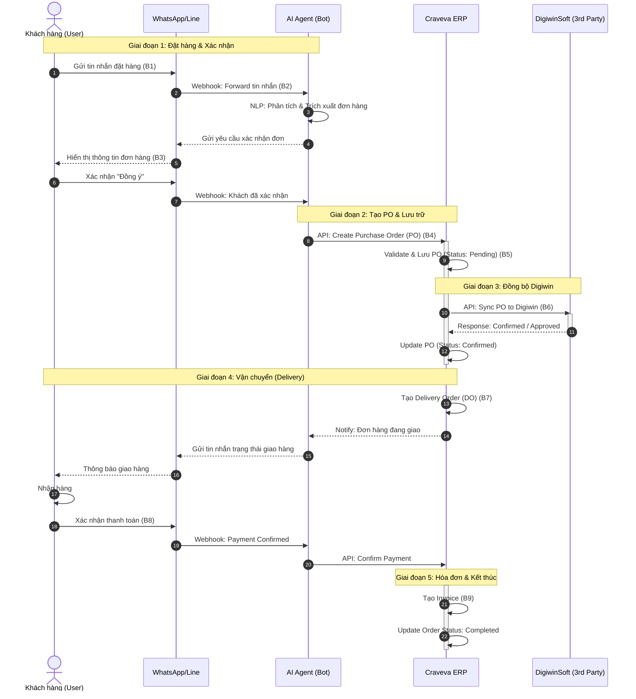

# Diagram Quy trình Đặt hàng AI Chat

```mermaid
sequenceDiagram
    autonumber
    actor Customer as Khách hàng (User)
    participant ChatPlatform as WhatsApp/Line
    participant AIAgent as AI Agent (Bot)
    participant Craveva as Craveva ERP
    participant Digiwin as DigiwinSoft (3rd Party)

    Note over Customer, AIAgent: Giai đoạn 1: Đặt hàng & Xác nhận
    Customer->>ChatPlatform: Gửi tin nhắn đặt hàng (B1)
    ChatPlatform->>AIAgent: Webhook: Forward tin nhắn (B2)
    AIAgent->>AIAgent: NLP: Phân tích & Trích xuất đơn hàng
    AIAgent-->>ChatPlatform: Gửi yêu cầu xác nhận đơn
    ChatPlatform-->>Customer: Hiển thị thông tin đơn hàng (B3)
    Customer->>ChatPlatform: Xác nhận "Đồng ý"
    ChatPlatform->>AIAgent: Webhook: Khách đã xác nhận

    Note over AIAgent, Craveva: Giai đoạn 2: Tạo PO & Lưu trữ
    AIAgent->>Craveva: API: Create Purchase Order (PO) (B4)
    activate Craveva
    Craveva->>Craveva: Validate & Lưu PO (Status: Pending) (B5)
    
    Note over Craveva, Digiwin: Giai đoạn 3: Đồng bộ Digiwin
    Craveva->>Digiwin: API: Sync PO to Digiwin (B6)
    activate Digiwin
    Digiwin-->>Craveva: Response: Confirmed / Approved
    deactivate Digiwin
    Craveva->>Craveva: Update PO (Status: Confirmed)
    deactivate Craveva

    Note over Craveva, Customer: Giai đoạn 4: Vận chuyển (Delivery)
    Craveva->>Craveva: Tạo Delivery Order (DO) (B7)
    Craveva-->>AIAgent: Notify: Đơn hàng đang giao
    AIAgent-->>ChatPlatform: Gửi tin nhắn trạng thái giao hàng
    ChatPlatform-->>Customer: Thông báo giao hàng
    
    Customer->>Customer: Nhận hàng
    Customer->>ChatPlatform: Xác nhận thanh toán (B8)
    ChatPlatform->>AIAgent: Webhook: Payment Confirmed
    AIAgent->>Craveva: API: Confirm Payment

    Note over Craveva: Giai đoạn 5: Hóa đơn & Kết thúc
    activate Craveva
    Craveva->>Craveva: Tạo Invoice (B9)
    Craveva->>Craveva: Update Order Status: Completed
    deactivate Craveva
```
