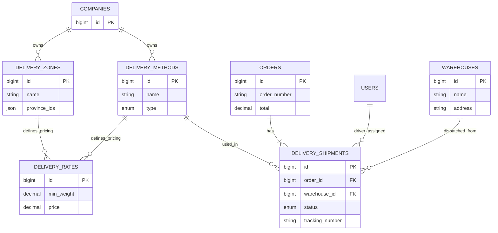

# PHÂN TÍCH CẤU TRÚC DATABASE - MODULE DELIVERY (GIAO VẬN B2B)

Tài liệu này định nghĩa chi tiết các bảng dữ liệu cần tạo cho Module **Delivery** và mối quan hệ của chúng với các bảng Core hiện có của hệ thống (ERP).

---

## 1. Tổng quan Quan hệ (Entity Relationship Overview)

Module Delivery đóng vai trò trung gian, kết nối giữa **Đơn hàng (Sales)** và **Kho (Warehouse)** để thực hiện việc giao vận.

### Các bảng hiện có cần kết nối (Existing Core Tables):

1.  **`companies`** (Table: `companies`)
    - **Vai trò:** Multi-tenancy. Mọi dữ liệu cấu hình vận chuyển phải gắn với `company_id`.
2.  **`orders`** (Table: `orders`)
    - **Vai trò:** Đơn hàng gốc cần giao.
    - **Quan hệ:** Một Order có thể có 1 hoặc nhiều Shipment (nếu giao nhiều lần).
3.  **`warehouses`** (Table: `warehouses` - thuộc Module Warehouse)
    - **Vai trò:** Điểm xuất phát của hàng hóa. Dùng để tính khoảng cách/phí ship đến khách hàng.
4.  **`users`** (Table: `users`)
    - **Vai trò:** Định danh người tạo đơn, tài xế (nếu có), hoặc khách hàng nhận hàng.

---

## 2. Chi tiết các bảng mới (New Tables Specification)

Chúng ta cần tạo 4 bảng chính cho nghiệp vụ Giao vận B2B.

### 2.1. Bảng `delivery_zones` (Vùng vận chuyển)

Dùng để định nghĩa các khu vực địa lý có cùng chính sách giá (Ví dụ: "Nội thành", "Ngoại thành", "Tỉnh lẻ").

| Column Name    | Data Type    | Description                                                        |
| :------------- | :----------- | :----------------------------------------------------------------- |
| `id`           | BIGINT (PK)  |                                                                    |
| `company_id`   | BIGINT (FK)  | Liên kết bảng `companies`.                                         |
| `name`         | VARCHAR(255) | Tên vùng (VD: Hồ Chí Minh - Nội thành).                            |
| `display_name` | VARCHAR(255) | Tên hiển thị cho khách (nếu cần khác tên quản trị).                |
| `province_ids` | JSON         | Danh sách ID Tỉnh/Thành phố thuộc vùng này. VD: `[1, 79]`          |
| `district_ids` | JSON         | Danh sách ID Quận/Huyện (nếu chia nhỏ theo quận). VD: `[101, 102]` |
| `is_active`    | BOOLEAN      | Trạng thái kích hoạt.                                              |

### 2.2. Bảng `delivery_methods` (Phương thức giao hàng)

Định nghĩa các cách thức giao hàng (VD: Xe tải lạnh, Xe máy, Khách tự lấy).

| Column Name   | Data Type    | Description                                                                                                    |
| :------------ | :----------- | :------------------------------------------------------------------------------------------------------------- |
| `id`          | BIGINT (PK)  |                                                                                                                |
| `company_id`  | BIGINT (FK)  | Liên kết bảng `companies`.                                                                                     |
| `name`        | VARCHAR(255) | Tên phương thức (VD: Standard Delivery, Express).                                                              |
| `description` | TEXT         | Mô tả chi tiết (hiển thị khi checkout).                                                                        |
| `type`        | ENUM         | Loại tính phí: `'flat_rate'` (Đồng giá), `'table_rate'` (Theo bảng), `'free'` (Miễn phí), `'pickup'` (Tự lấy). |
| `is_active`   | BOOLEAN      |                                                                                                                |

### 2.3. Bảng `delivery_rates` (Bảng giá cước)

Chứa logic tính tiền chi tiết. Đây là bảng quan trọng nhất để tính toán chi phí B2B.

| Column Name          | Data Type     | Description                                                        |
| :------------------- | :------------ | :----------------------------------------------------------------- |
| `id`                 | BIGINT (PK)   |                                                                    |
| `delivery_zone_id`   | BIGINT (FK)   | Liên kết `delivery_zones`. Áp dụng cho vùng nào?                   |
| `delivery_method_id` | BIGINT (FK)   | Liên kết `delivery_methods`. Áp dụng cho phương thức nào?          |
| `min_weight`         | DECIMAL(10,2) | Trọng lượng tối thiểu (kg).                                        |
| `max_weight`         | DECIMAL(10,2) | Trọng lượng tối đa (kg). Null = Vô cùng.                           |
| `min_order_price`    | DECIMAL(15,2) | Giá trị đơn hàng tối thiểu (để set Free Ship).                     |
| `base_cost`          | DECIMAL(15,2) | Phí cố định (Flat fee).                                            |
| `unit_cost`          | DECIMAL(15,2) | Phí cộng thêm mỗi đơn vị (VD: 2k/kg).                              |
| `tier_type`          | ENUM          | `'weight'` (theo cân), `'price'` (theo tiền), `'fixed'` (cố định). |

### 2.4. Bảng `delivery_shipments` (Lô giao hàng)

Lưu trữ thông tin thực tế của việc giao hàng. Tách biệt với bảng `orders` để hỗ trợ giao một phần (Partial Delivery).

| Column Name            | Data Type     | Description                                                                        |
| :--------------------- | :------------ | :--------------------------------------------------------------------------------- |
| `id`                   | BIGINT (PK)   |                                                                                    |
| `company_id`           | BIGINT (FK)   | Liên kết `companies`.                                                              |
| `order_id`             | BIGINT (FK)   | Liên kết bảng `orders`. Đơn hàng gốc.                                              |
| `warehouse_id`         | BIGINT (FK)   | Liên kết bảng `warehouses`. Hàng xuất đi từ kho nào?                               |
| `delivery_method_id`   | BIGINT (FK)   | Phương thức đã chọn.                                                               |
| `status`               | ENUM          | `'draft'`, `'processing'`, `'packed'`, `'shipping'`, `'delivered'`, `'cancelled'`. |
| `tracking_number`      | VARCHAR(100)  | Mã vận đơn (nếu thuê bên thứ 3) hoặc mã nội bộ.                                    |
| `driver_id`            | BIGINT (FK)   | Liên kết `users` (nếu là tài xế nội bộ). Nullable.                                 |
| `weight`               | DECIMAL(10,2) | Tổng trọng lượng thực tế của lô hàng này.                                          |
| `shipping_cost`        | DECIMAL(15,2) | Chi phí vận chuyển tính toán được (thu của khách).                                 |
| `actual_shipping_cost` | DECIMAL(15,2) | Chi phí thực tế phải trả (cho bên vận chuyển/xăng dầu).                            |
| `note`                 | TEXT          | Ghi chú giao hàng.                                                                 |

---

## 3. Sơ đồ Quan hệ (ER Diagram)

---

## 4. Ghi chú triển khai (Implementation Notes)

### 4.1. Ràng buộc khóa ngoại (Foreign Keys)

- Tất cả các bảng mới **bắt buộc** phải có `company_id` để đảm bảo tính năng Multi-tenancy.
- Khi truy vấn, luôn phải thêm điều kiện `where('company_id', company()->id)`.

### 4.2. Logic tính phí (Calculation Logic)

Khi người dùng checkout hoặc Sale tạo đơn:

1.  Lấy địa chỉ người nhận -> Đối chiếu với `province_ids/district_ids` trong bảng `delivery_zones` -> Xác định **Zone ID**.
2.  Lấy tổng trọng lượng sản phẩm trong giỏ hàng.
3.  Query bảng `delivery_rates`:
    - `WHERE zone_id = [Zone ID]`
    - `WHERE method_id = [Method ID]`
    - `WHERE min_weight <= [Total Weight]`
    - `ORDER BY min_weight DESC LIMIT 1`
4.  Trả về kết quả phí ship.

## 6. Phân tích Tích hợp B2B - ERP (Integration Strategy)

Dựa trên yêu cầu: **ERP là nơi lưu trữ dữ liệu chính (Master Data)**, còn B2B App là kênh bán hàng (Sales Channel) đẩy đơn về.

### 6.1. Vấn đề "Ai tính phí ship?" (Who calculates shipping?)

Có 2 kịch bản tích hợp:

**Kịch bản A: B2B App tự tính phí (Decoupled Logic)**

- B2B App có logic tính phí riêng (hoặc gọi API bên thứ 3).
- Khi đẩy đơn về ERP, nó gửi kèm con số: `shipping_fee = 50,000`.
- **ERP:** Chỉ cần **Phương án Minimal** (Bảng `shipments` đơn giản) để lưu con số 50,000 đó.
- **Ưu điểm:** Giảm tải cho ERP, B2B App chạy nhanh hơn.

**Kịch bản B: B2B App hỏi ERP (Centralized Logic)**

- Khách chọn địa chỉ trên B2B App -> App gọi API về ERP: `POST /api/delivery/calculate-fee`.
- ERP tính toán dựa trên cấu hình (Zone, Weight, Rate) và trả về kết quả.
- **ERP:** Bắt buộc dùng **Phương án Full** (4 bảng: Zones, Methods, Rates...).
- **Ưu điểm:** Quản lý giá tập trung tại 1 nơi (ERP). Khi thay đổi giá xăng, chỉ cần sửa trên ERP, App tự cập nhật. **Đây là mô hình chuẩn cho doanh nghiệp muốn kiểm soát chặt chẽ.**

### 6.2. Kết luận kiến trúc

Vì ERP được định nghĩa là **"Nơi lưu trữ dữ liệu chính"** và thường là nơi Admin cấu hình mọi chính sách giá (để áp dụng cho cả bán buôn, bán lẻ, nhân viên sale tự tạo đơn), nên **Phương án Full (4 bảng)** là lựa chọn an toàn và đúng đắn nhất về lâu dài.

Nó cho phép:

1.  Admin cấu hình bảng giá trên ERP.
2.  B2B App gọi API lấy giá (hoặc đồng bộ bảng giá về cache).
3.  Khi đơn hàng được đẩy về ERP, dữ liệu khớp hoàn toàn với cấu hình.
