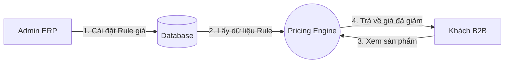
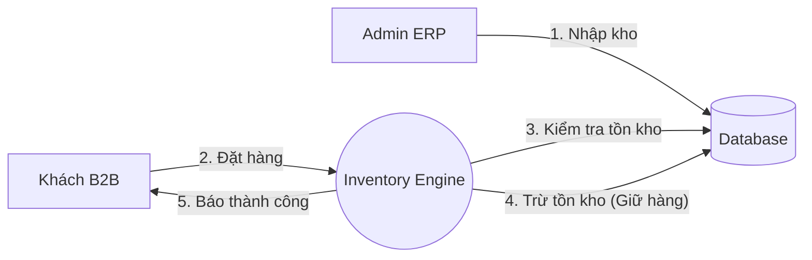

# Phân Chia Trách Nhiệm: ERP (Admin) vs B2B (Khách Hàng)

Tài liệu này minh họa rõ ràng nơi thực hiện logic (Code), nơi quản lý (ERP) và nơi hiển thị (B2B) cho 3 tính năng cốt lõi: **Tier Pricing, Multi-Warehouse, Delivery**.

---

## 1. Hình Ảnh Minh Họa: "Mô Hình Nhà Hàng"

Để dễ hình dung, hãy xem hệ thống như một nhà hàng:

| Thành phần hệ thống       | Ví dụ Nhà Hàng        | Vai trò                                                                             |
| :------------------------ | :-------------------- | :---------------------------------------------------------------------------------- |
| **Backend (Modules)**     | **Nhà Bếp & Kho**     | Nơi chứa nguyên liệu, công thức nấu ăn, quy định giá vốn. Khách không được vào đây. |
| **ERP (Admin Portal)**    | **Quản Lý & Phục Vụ** | Người ra quyết định thực đơn, set giá bán, kiểm kho, điều phối món ăn.              |
| **B2B (Customer Portal)** | **Bàn Ăn & Menu**     | Nơi khách ngồi, xem Menu (đã có giá), gọi món và thanh toán.                        |

> **Quy tắc vàng:** "Bếp (Backend) nấu món gì, Quản lý (ERP) duyệt giá nào, thì Khách (B2B) mới thấy món đó."

---

## 2. Bảng Phân Chia Chi Tiết

| Tính Năng                               | 🧠 Backend Logic (Code nằm ở đâu?)                                             | 🔧 ERP Admin View (Người quản lý làm gì?)                                                                               | 🛒 B2B Customer View (Khách hàng thấy gì?)                                                                        |
| :-------------------------------------- | :-------------------------------------------------------------------------------- | :------------------------------------------------------------------------------------------------------------------------- | :------------------------------------------------------------------------------------------------------------------- |
| **1. Tier Pricing** (Chính sách giá) | **`Modules/Pricing`** Chứa hàm tính toán: `calculatePrice()`                | **Người Tạo Luật Chơi** 🔹 Tạo Tier "VIP", "Đại lý". 🔹 Cài đặt: "Mua > 10 giảm 5%". 🔹 Gán khách A vào nhóm VIP. | **Người Hưởng Ưu Đãi** 🔹 Đăng nhập vào thấy giá đã giảm. 🔹 Thấy badge "Giá VIP". 🔹 _Không sửa được giá._ |
| **2. Multi-Warehouse** (Đa kho)      | **`Modules/Inventory`** Chứa logic tồn kho: `checkStock()`, `deductStock()` | **Người Quản Lý Kho** 🔹 Nhập 100 cái về kho HCM. 🔹 Chuyển 50 cái ra kho HN. 🔹 Xem báo cáo tồn tổng.            | **Người Kiểm Tra** 🔹 Xem sản phẩm: "Còn hàng". 🔹 Hệ thống tự chọn kho gần nhất để báo có hàng hay không.     |
| **3. Delivery** (Vận chuyển)         | **`Modules/Order`** Chứa logic phí ship: `calculateShipping()`              | **Người Cấu Hình** 🔹 Chọn đối tác (GHTK, Viettel). 🔹 Cài đặt phí ship nội bộ. 🔹 Duyệt đơn hàng đi giao.        | **Người Sử Dụng** 🔹 Chọn địa chỉ nhận hàng. 🔹 Thấy phí ship dự kiến. 🔹 Theo dõi mã vận đơn.              |

---

## 3. Luồng Dữ Liệu (Data Flow Diagram)

### A. Luồng Pricing (Giá cả)

### B. Luồng Warehouse (Kho hàng)

---

## 4. Hạ Tầng: Database Dùng Chung (Single Database)

### Tại sao dùng chung? (Mô hình "Cây ATM")

Dù ERP (hub.craveva.com) và B2B (deerpos.craveva.com) là 2 website khác nhau, chúng nên dùng chung **1 Database**.
Giống như cây ATM: Dù anh rút tiền ở cây ATM Hội sở (ERP) hay cây ATM ngoài phố (B2B), tiền đều trừ vào **Két sắt tổng (Database)**.

| Lợi ích      | Giải thích                                                                    |
| :----------- | :---------------------------------------------------------------------------- |
| **Tức thời** | Admin sửa giá -> Khách thấy ngay. Khách mua hàng -> Kho trừ ngay.             |
| **Đơn giản** | Không cần viết API đồng bộ (Sync) phức tạp giữa 2 nơi.                        |
| **Bảo mật**  | Admin được `SELECT *`. Khách chỉ được `SELECT WHERE id = me` (Code tự xử lý). |

### Lộ Trình Mở Rộng (Scalability Roadmap) - Chi Tiết Kỹ Thuật

| Giai đoạn                           | Dấu hiệu nhận biết (Trigger)                                                                    | Giải pháp Kỹ thuật                                                                                                             | Thay đổi trong Code                                                                             |
| :---------------------------------- | :---------------------------------------------------------------------------------------------- | :----------------------------------------------------------------------------------------------------------------------------- | :---------------------------------------------------------------------------------------------- |
| **1. Khởi đầu** (Single DB)      | • Dưới 500 người dùng cùng lúc. • Bảng đơn hàng < 1 triệu dòng. • CPU Server < 50%.       | **1 Database Duy Nhất** Tối ưu bằng cách đánh Index và dùng Cache (Redis) cho các query nặng.                               | Không thay đổi. Code chuẩn Laravel.                                                          |
| **2. Tăng trưởng** (Replication) | • Database báo quá tải (CPU > 80%). • Đọc dữ liệu bị chậm, nhưng Ghi vẫn nhanh.              | **Tách Đọc/Ghi (Read/Write Splitting)** • 1 Master DB: Chỉ để Ghi (Create/Update). • 2-3 Slave DBs: Chỉ để Đọc (Select). | Cấu hình `config/database.php` tách connection `read` và `write`. Logic Code vẫn giữ nguyên. |
| **3. Mở rộng lớn** (Tenancy)     | • Dữ liệu quá lớn (> 10GB/bảng). • Khách hàng muốn Database riêng biệt để bảo mật tuyệt đối. | **Multi-Database (Tenancy)** Mỗi công ty khách hàng lớn có 1 Database riêng.                                                | Cài gói `stancl/tenancy`. Middleware tự động chọn DB khi khách đăng nhập.                    |
| **4. Khổng lồ** (Microservices)  | • Team Dev quá đông (> 50 người). • Module này sửa làm chết Module kia.                      | **Microservices** Tách hẳn Service Pricing, Service Inventory ra server riêng, DB riêng.                                    | Viết lại Code. Giao tiếp qua API nội bộ (gRPC/REST) thay vì gọi hàm trực tiếp.               |

> **Lưu ý cho tương lai:** Hiện tại cứ viết code chuẩn theo **Modular Monolith** (chia module rõ ràng trong 1 source code). Sau này khi cần lên Giai đoạn 4 sẽ rất dễ tách, không phải đập đi xây lại.

> **Kết luận:** Hiện tại dùng mô hình **1 Database** là tối ưu nhất về chi phí và vận hành.

---

## 5. Tổng Kết Cho Developer

Khi anh viết code, hãy tuân thủ nguyên tắc **"Một não, Hai mặt"**:

1.  **Một bộ não (One Brain):** Viết logic xử lý (Service/Model) nằm gọn trong thư mục `Modules/`. Ví dụ: `PricingService.php` chỉ viết 1 lần.
2.  **Mặt Admin (ERP Face):** Viết Controller/View để **GHI** dữ liệu vào (Create/Update/Delete settings).
3.  **Mặt Khách (B2B Face):** Viết Controller/View để **ĐỌC** dữ liệu ra và áp dụng (Read/Apply settings).

**Ví dụ thực tế:**

-   Anh viết hàm `calculateDiscount($product, $quantity)` trong `PricingService`.
-   Ở **ERP**, anh dùng hàm này để Sale xem thử giá (Preview).
-   Ở **B2B**, anh dùng hàm này để hiển thị giá cuối cùng cho khách mua.
