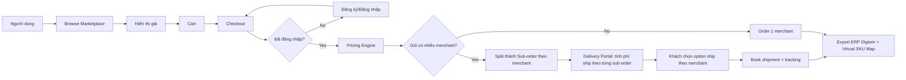
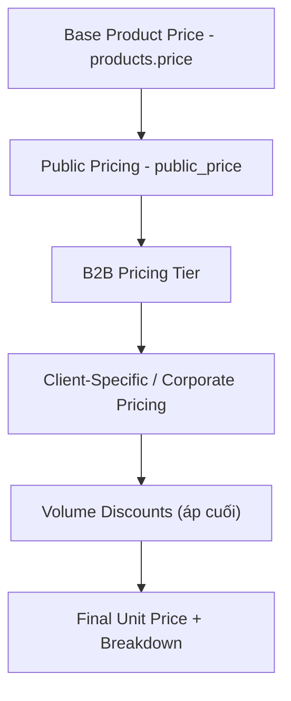
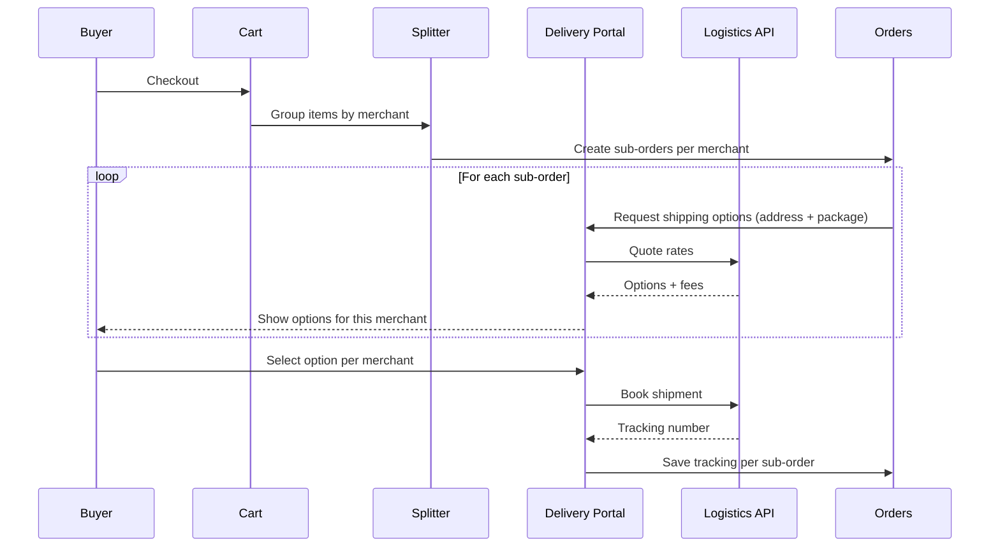

# Phân tích yêu cầu khách hàng (Miao Lin SRS) & đối chiếu hệ thống hiện có

Nguồn tài liệu:

-   `NEW FUNCTION/Miao Lin-系统需求规格.docx`
-   Bản dịch/summary đang có trong repo:
    -   `new function/Miao Lin-系统需求规格.vi.md`
    -   `new function/Miao Lin-系统需求规格.summary.vi.md`

Mục tiêu tài liệu này:

1. Tóm tắt “khách hàng muốn gì” theo SRS.
2. Đối chiếu với chức năng hiện có trong codebase.
3. Liệt kê backlog các việc cần làm (theo epic/phase) để triển khai.

---

## Sơ đồ tổng quan (để dễ hình dung)

### A) Bức tranh end-to-end (Browse → Pricing → Checkout → Split → Delivery → ERP)

### B) Sơ đồ áp giá (Pricing hierarchy theo SRS)

### C) Split order & giao nhận theo merchant

---

## 1) Khách hàng muốn gì (Business intent)

Theo SRS, khách hàng muốn xây dựng một **marketplace B2B đa thương nhân (multi-merchant)** với:

1. **Môi trường mua hàng bắt buộc đăng nhập** (guest có thể browse, nhưng checkout phải đăng nhập).
2. **Định giá nhiều tầng (multi-level pricing)**, phân biệt:
    - Giá công khai (public) vs giá B2B theo tier
    - Giá riêng theo khách hàng B2B (client-specific/corporate)
    - Chiết khấu theo lượng áp dụng như bước cuối (volume discount)
3. **Xử lý đơn hàng đa thương nhân**: giỏ hàng có thể chứa hàng từ nhiều merchant → hệ thống tự tách sub-order theo từng merchant.
4. **Cổng giao nhận (delivery portal)**: tích hợp API logistics, tính phí ship realtime, tracking/webhook, khách chọn phương án giao hàng theo từng merchant/sub-order.
5. **Xuất đơn tương thích ERP Digiwin (鼎新)**, có **Virtual SKU Map** (ví dụ qty ≥ 6 map sang Box SKU trong file ERP).

Tham chiếu (bản dịch): `new function/Miao Lin-系统需求规格.vi.md`.

---

## 2) Các nhóm người dùng và hành vi chính (Users & flows)

### 2.1 Public Customer

-   Browse marketplace, xem giá công khai.
-   Khi checkout: bắt buộc tạo tài khoản/đăng nhập.

### 2.2 B2B Company User

-   Được hưởng tier giá B2B + chiết khấu.
-   Có UI hiển thị so sánh giá và tiết kiệm (pricing comparison + breakdown).
-   Đặt hàng thay mặt công ty.

### 2.3 Merchant Company

-   Quản lý niêm yết sản phẩm marketplace.
-   Cấu hình public price / tier price / volume.
-   Cấu hình giá riêng theo khách hàng (client-specific/corporate).

---

## 3) Đối chiếu với hệ thống hiện có (As-is) – có gì / thiếu gì

### 3.1 Hiện có (đã có trong codebase)

1. **Sản phẩm (product catalog nội bộ)**

-   `app/Http/Controllers/ProductController.php:47-64` (list)
-   `app/Http/Controllers/ProductController.php:103-147` (create)
-   Dữ liệu sản phẩm có `price` (giá cơ sở): `database/migrations/2018_01_01_000000_create_craveva_new_table.php:1827-1849`

2. **Order (đơn hàng nội bộ) + nhập discount thủ công**

-   `app/Http/Controllers/OrderController.php:157-174` (save order với `discount`/`discount_type` từ request)
-   Schema orders hiện không có các trường marketplace/split/sub-order: `database/migrations/2018_01_01_000000_create_craveva_new_table.php:1230-1253`

3. **CRM Deal/Proposal (có sẵn module proposal)**

-   `app/Http/Controllers/DealController.php:756-768` (tab proposals)
-   `app/Http/Controllers/ProposalController.php:51-119` (create proposal)
-   Proposal hiện tính `unit_price/amount` từ input, chưa có auto pricing engine theo buyer company: `app/Http/Controllers/ProposalController.php:160-178`

4. **Invitation flow (mời user vào company)**

-   `app/Http/Controllers/RegisterController.php:26-137` (accept invite → tạo user + gán role employee)
-   `app/Http/Controllers/EmployeeController.php:1194-1226` (send invite email)

5. **Nền tảng rule chiết khấu theo lượng (module Discount)**

-   `Modules/Discount/Services/DiscountCalculatorService.php:17-101` (áp rule theo scope/trigger cho item)
-   Lưu ý: module này là “volume discount engine” ở mức rule, nhưng chưa bao phủ Tier pricing/corporate pricing theo SRS.

### 3.2 Chưa có hoặc thiếu (theo SRS)

1. **Pricing hierarchy đủ 5 tầng (Base/Public/Tier/Client-specific/Volume-last)**

-   Hiện chỉ có `products.price` (base) và discount thủ công ở order/proposal.
-   Chưa có bảng/field như `public_price`, `pricing_tiers`, `client_product_pricing`.

2. **Marketplace listing + visibility**

-   SRS yêu cầu `is_marketplace_listed`, `marketplace_visibility`.
-   Hiện schema `products` không có các field này: `database/migrations/2018_01_01_000000_create_craveva_new_table.php:1827-1849`.

3. **Corporate pricing (company-to-company) + client-specific pricing theo sản phẩm**

-   Chưa có bảng quan hệ seller→buyer để set tier/discount/price theo từng buyer.

4. **Multi-merchant cart + auto split order**

-   Chưa có khái niệm `seller_company_id`, `order_split_by_merchant`, sub-order.

5. **Delivery portal + logistics API + tracking/webhook**

-   Chưa có các bảng như `delivery_companies`, `delivery_options`, `order_deliveries`.

6. **ERP Digiwin export + Virtual SKU Map**

-   Chưa có chức năng export theo format ERP và rule chuyển SKU theo ngưỡng (ví dụ qty ≥ 6).

---

## 4) Kết luận “khách hàng họ muốn gì” (One-liner theo epic)

1. Marketplace B2B đa thương nhân, bắt buộc login khi checkout.
2. Pricing engine nhiều tầng (public/tier/client-specific/volume-last) + UI so sánh giá.
3. Multi-merchant order processing: cart đa merchant → auto split sub-order.
4. Delivery portal: cấu hình hãng giao nhận, tính ship realtime theo sub-order, tracking/webhook.
5. ERP Digiwin: export order + Virtual SKU mapping.

---

## 5) Backlog các việc cần làm (To-be) – theo Epic/Phase

### Epic A — Data model cho marketplace + pricing

A1) Bổ sung dữ liệu sản phẩm phục vụ marketplace

-   Thêm field/setting cho marketplace listing & public pricing.
-   Kết quả: sản phẩm có thể cấu hình “public/b2b-only/hidden” và giá public.

A2) Pricing tiers & tier items

-   Tạo bảng `pricing_tiers`, `pricing_tier_items`.
-   Kết quả: merchant/admin tạo tier, gán tier cho product/category.

A3) Corporate pricing (seller→buyer)

-   Tạo bảng quan hệ buyer company để set tier/discount/price theo buyer.

A4) Volume discount rules (nếu không tái dùng module Discount hiện có)

-   Chuẩn hóa rule theo order value/quantity và theo scope.

### Epic B — Pricing Engine (business logic)

B1) Pricing resolution order + breakdown

-   Implement engine tính `final_unit_price` và `applied_rules`.

B2) Tích hợp engine vào Proposal

-   Tự set giá khi add product vào proposal và khi update quantity.
-   Điểm tích hợp hiện tại: `app/Http/Controllers/ProposalController.php`.

B3) Tích hợp engine vào Order/Cart

-   Tự tính giá khi add/update giỏ hàng và khi tạo order.
-   Điểm tích hợp hiện tại: `app/Http/Controllers/OrderController.php`, `app/Http/Controllers/ProductController.php`.

B4) UI pricing comparison cho B2B

-   Hiển thị “Giá gốc / Giá của bạn / Tiết kiệm / Breakdown”.

### Epic C — Multi-merchant order processing

C1) Gán merchant cho sản phẩm

-   Chuẩn hóa nguồn “seller company” của product.

C2) Cart đa merchant

-   Cho phép giỏ chứa item từ nhiều merchant.

C3) Auto split order

-   Khi checkout, tách order thành sub-orders theo merchant.
-   Lưu dữ liệu split để tracking và xuất ERP.

### Epic D — Delivery portal (logistics)

D1) Module cấu hình hãng giao nhận

-   CRUD delivery companies + cấu hình endpoint/auth/rate limit/webhook.

D2) Tính phí ship realtime theo sub-order

-   Gọi API để lấy shipping options/fees.

D3) Tạo shipment + tracking per sub-order

-   Lưu tracking number, status, webhook data.

### Epic E — ERP Digiwin export + Virtual SKU Map

E1) Thiết kế format xuất ERP

-   Mapping field order/sub-order/item theo yêu cầu Digiwin.

E2) Virtual SKU map

-   Rule chuyển SKU theo quantity (ví dụ qty ≥ 6) và theo cấu hình merchant/sản phẩm.

E3) Job/scheduler export

-   Sinh file export theo trạng thái đơn.

### Epic F — QA/UAT & vận hành

F1) Test matrix pricing

-   Case public/b2b tier/client-specific/volume-last + rounding.

F2) Test matrix multi-merchant shipping

-   Split order, option ship per merchant, tracking, lỗi API.

F3) UAT checklist ERP

-   Đối soát file export với Digiwin.

---

## 6) Gợi ý ưu tiên triển khai (để ra giá trị sớm)

1. Pricing engine (Epic A + B) để ra “đúng giá” trước.
2. Proposal integration (B2) nếu khách dùng sales pipeline.
3. Multi-merchant + delivery portal (Epic C + D) vì phụ thuộc nhiều.
4. ERP export + virtual SKU (Epic E) triển khai khi đã có sub-order ổn định.
