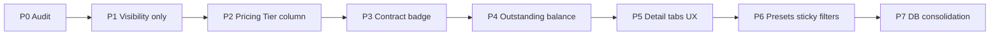

# Kế hoạch: Client Listing Table — UX theo PM (2026-05)

**Mục tiêu:** Bảng Clients = **tóm tắt vận hành** (scan nhanh). Chi tiết pricing / contract / volume → **trang client detail** và module **Pricing**.

**Tham chiếu PM:** quyết định cột mặc định / optional / không hiển thị; badge Contract; preset role (Sales / Finance / Logistics).

**Code chính hiện tại:**

| Thành phần              | Đường dẫn                                                                                       |
| ----------------------- | ----------------------------------------------------------------------------------------------- |
| DataTable list          | `app/DataTables/ClientsDataTable.php`                                                           |
| View list               | `resources/views/clients/index.blade.php`                                                       |
| Detail tabs             | `resources/views/clients/show.blade.php`                                                        |
| Import map              | `app/Imports/ClientImport.php`, `app/Services/ClientImportProcessor.php`                        |
| Pricing tier gán client | `client_details.pricing_tier_id` — UI `Modules/Pricing` → Client Tiers (`ClientTierController`) |
| Contract pricing        | Bảng `client_product_pricing` — menu Contract Pricing                                           |
| Custom field client     | Nhóm **Client** → model `App\Models\ClientDetails` → `custom_fields` + `custom_fields_data`     |

**Tài liệu liên quan:** `FUNC_LOGIC/FLOW_ADD_CLIENT.md`, `FLOW_Pricing_Module_VI.md`, `07_PRICING_MODULE_DEV_TASKS.md`, `UX_MENU_AND_SETTINGS_VI.md` Phần D (UX-006).

---

## 1. Hiện trạng hệ thống (quan trọng khi lập kế hoạch)

### 1.1 Hai nguồn dữ liệu khác nhau — không được nhầm

| Khái niệm PM                                         | Trong Craveva                                  | Lưu trữ                                                                                   | Ghi chú                                                                                 |
| ---------------------------------------------------- | ---------------------------------------------- | ----------------------------------------------------------------------------------------- | --------------------------------------------------------------------------------------- |
| **Pricing Tier**                                     | Tier giá B2B (giảm % / rule SKU)               | `client_details.pricing_tier_id` → `pricing_tiers`                                        | Module **Pricing** → **Client Tiers** / **Tiers**. **Không** phải custom field.         |
| **Client Tier** (PM optional)                        | Có thể là **Customer Grade** / phân hạng khách | Custom `customer_grade` **và** cột DB `client_details.customer_grade` (migration 2026-04) | PM gọi "Client Tier" = hạng khách nghiệp vụ, **khác** Pricing Tier.                     |
| **Contract Pricing Active**                          | Có hợp đồng SP đang hiệu lực?                  | `client_product_pricing` (`is_active`, `start_date`, `end_date`)                          | Chỉ hiển thị **Yes/No** hoặc badge `[Contract]` — **không** list giá từng SP trên bảng. |
| **Outstanding Balance**                              | Công nợ khách                                  | Chưa có trên list; logic có sẵn trên model `Invoice::amountDue()`                         | Cần aggregate theo `invoices.client_id` — **performance** cần thiết kế (Phase 4+).      |
| Salesperson, Assistant, Last transaction, Geography… | Miaolin / ERP                                  | **`custom_fields_data`** (tên field cố định trong import)                                 | Cột list merge động qua `CustomFieldGroup::customFieldsDataMerge()`.                    |

### 1.2 Cột cố định trong `ClientsDataTable` (không qua Custom Field)

Đang **visible mặc định:** Client Code, Name, Email, Mobile, Category, Status, Created At.

Đang **ẩn mặc định (`visible => false`):** Salutation, Added By, Payment Terms, Customer Grade, Channel Type, Business Type, Business Closure Date.

→ PM muốn **bỏ khỏi mặc định:** Email, Mobile, Category, Created At.  
→ Một số field PM gọi optional (Payment Terms, Customer Grade) **đã ẩn** trong code nhưng vẫn có trên form/import.

### 1.3 Custom Field trên bảng Clients

- `CustomField::exportCustomFields()` load field có `export = 1` **hoặc** `visible = 'true'`.
- `customFieldsDataMerge()` đặt `visible` cột DataTable từ cột `custom_fields.visible` (null → false).
- Field Miaolin (`salesperson`, `sales_assistant_name`, `last_transaction_at`, …) thường `export = 1` → **luôn có trong định nghĩa cột**; hiển thị mặc định phụ thuộc `visible` trong DB.
- **Import không phụ thuộc** `export`/`visible` của custom field — map theo `ClientImportProcessor::getClientCustomFieldNames()` (hardcode). **Đổi visibility list không làm hỏng import.**

### 1.4 Trùng lặp DB vs Custom Field (technical debt — xử lý sau)

Migration `2026_04_01_120000_add_core_commercial_fields_to_client_details_table.php` đã thêm cột DB: `payment_terms`, `customer_grade`, `channel_type`, `business_type`, `business_closure_date`.

Đồng thời import/form vẫn ghi **custom field** cùng tên (`payment_terms`, `customer_grade`, …). DataTable đọc **cột DB** cho một số cột hardcode; custom field vẫn có thể hiện **thêm một lần nữa** nếu admin bật `export`/`visible`.

**Nguyên tắc kế hoạch:** Phase 1–3 **không gộp/migrate** hai nguồn; chỉ điều chỉnh **hiển thị** và **cột đọc thêm** (pricing tier, contract flag). Phase 7 mới xem xét đồng bộ dữ liệu DB.

### 1.5 Field PM đề cập nhưng có thể chưa có trong repo

| Field                      | Trạng thái                                                                                                                                 |
| -------------------------- | ------------------------------------------------------------------------------------------------------------------------------------------ |
| `geographical_distinction` | Có trong `FUNC_IMPORT/IMPORT_SPECS_VI.md`; **chưa** thấy migration tạo custom field — có thể chỉ có trên staging (tạo tay trong Settings). |
| `credit_limit`             | PM optional — **chưa** thấy cột DB/custom field chuẩn; cần PM xác nhận nguồn trước khi làm cột.                                            |

---

## 2. Mục tiêu UX (đồng bộ PM)

### 2.1 Cột mặc định (SHOW BY DEFAULT)

1. Client Code
2. Name
3. Pricing Tier
4. Contract Pricing Active (Yes/No hoặc badge `[Contract]`)
5. Outstanding Balance
6. Last Transaction Date
7. Salesperson
8. Status

(+ checkbox, action như hiện tại)

### 2.2 Cột optional (Columns toggle — ẩn mặc định)

- Client Tier → map `customer_grade` (DB và/hoặc custom field — **một cột**, tránh trùng)
- Geographical Distinction
- Sales Assistant → `sales_assistant_name`
- Payment Terms
- Credit Limit (sau khi xác nhận nguồn dữ liệu)

### 2.3 Không đưa vào bảng

- Chi tiết contract pricing, giá từng SP, volume rules

### 2.4 Tầm nhìn (phase sau — không chặn phase 1)

- Trang detail: tab Overview, Pricing, Contract Pricing, Orders, Invoices, Payments, Credit, Contacts
- Badge màu status, sticky cột, saved filters, preset **Sales / Finance / Logistics**

---

## 3. Nguyên tắc triển khai

1. **Không đổi logic nghiệp vụ** ở phase đầu: store/update client, import, `PricingService`, gán tier, contract CRUD.
2. **Ưu tiên thay đổi chỉ UI/DataTable** (visibility, label, badge, join read-only).
3. **Thay đổi `custom_fields` table (visible/export)** = metadata hiển thị, **không** đổi import — làm Phase 2 nếu không override bằng code.
4. **Migration schema / cache cột / đồng bộ DB↔custom field** = phase cuối, có backup và test import.
5. Mỗi phase có **checklist regression** (list, filter, export Excel, import 1 dòng, edit client, gán tier Pricing).

---

## 4. Lộ trình theo phase (ưu tiên)

---

### Phase 0 — Audit & align PM (không đổi code, hoặc chỉ doc)

**Mục đích:** Chốt mapping trước khi dev.

| #   | Việc                                                                                                                                 | Output                |
| --- | ------------------------------------------------------------------------------------------------------------------------------------ | --------------------- |
| 0.1 | Chụp/export cấu hình `custom_fields` nhóm Client trên staging (name, visible, export, sort_order)                                    | Bảng audit            |
| 0.2 | Xác nhận PM: **Outstanding** = tổng `amountDue()` invoice unpaid/partial? có trừ credit note? đơn vị tiền?                           | 1 dòng rule trong doc |
| 0.3 | Xác nhận **Contract active** = tồn tại ≥1 dòng `client_product_pricing` active trong khoảng ngày? hay cả `company_customer_pricing`? | Rule                  |
| 0.4 | Kiểm tra field `geographical_distinction`, `credit_limit` có trên DB staging không                                                   | Có/không + tên field  |
| 0.5 | PM sign-off bảng cột mặc định/optional (hình 2, 3)                                                                                   | Approved              |

**Rủi ro:** Không.  
**Ảnh hưởng logic:** Không.

---

### Phase 1 — Chỉ visibility & thứ tự cột (P0 — an toàn nhất)

**Mục đích:** Giảm “noise” trên list **không** đụng DB schema, **không** đụng import.

| #    | Task                                                                                                                                                                                            | File / cách làm                                         | Ghi chú                           |
| ---- | ----------------------------------------------------------------------------------------------------------------------------------------------------------------------------------------------- | ------------------------------------------------------- | --------------------------------- |
| 1.1  | Ẩn mặc định: Email, Mobile, Category, Created At                                                                                                                                                | `ClientsDataTable::getColumns()` → `'visible' => false` | Vẫn bật lại qua nút **Columns**   |
| 1.2  | Override visibility custom field **theo tên** sau `customFieldsDataMerge()`                                                                                                                     | Cùng file hoặc helper nhỏ `ClientListColumnPolicy`      | Tránh sửa DB staging từng company |
| 1.2a | Default **true:** `salesperson`, `last_transaction_at`                                                                                                                                          | Policy map                                              |                                   |
| 1.2b | Default **false:** `sales_assistant_name`, `department`, `channel_type`, `business_type`, `geographical_distinction` (nếu có), `payment_terms` (custom), `customer_grade` (nếu chỉ dùng custom) | Policy map                                              | Tránh trùng với cột DB §1.4       |
| 1.3  | Giữ Status + dropdown edit như cũ (chưa đổi badge)                                                                                                                                              | —                                                       | Không đổi permission              |
| 1.4  | Cập nhật `$clientOrderMap` nếu đổi thứ tự cột                                                                                                                                                   | `ClientsDataTable`                                      | Chỉ ảnh hưởng sort custom field   |
| 1.5  | Test manual + Pest (nếu có test DataTable columns)                                                                                                                                              | `tests/Feature` hoặc unit policy                        |                                   |

**Không làm trong Phase 1:** thêm Pricing Tier, Outstanding, Contract; đổi `PricingService`; đổi import.

**Regression checklist:**

- [ ] `/account/clients` load, colvis bật/tắt cột
- [ ] Filter Added On / Client / Category vẫn chạy
- [ ] Export Excel (nếu có quyền)
- [ ] Import 1 client (create + update client_code)
- [ ] Edit client form — custom field vẫn lưu

**Rủi ro:** Thấp. User đã lưu state DataTables (`stateSave`) có thể giữ layout cũ → ghi chú “clear localStorage / reset columns” khi release.

---

### Phase 2 — Cột Pricing Tier (read-only, không migration)

**Mục đích:** Hiện tier gán sẵn từ module Pricing.

| #   | Task                                                                      | Chi tiết                                                                                    |
| --- | ------------------------------------------------------------------------- | ------------------------------------------------------------------------------------------- |
| 2.1 | `query()`: `leftJoin` `pricing_tiers` on `client_details.pricing_tier_id` | Select `pricing_tiers.name as pricing_tier_name`                                            |
| 2.2 | `addColumn('pricing_tier_name', …)`                                       | Hiển thị `--` nếu null                                                                      |
| 2.3 | Thêm cột vào `getColumns()` sau Name, **visible true**                    | Permission: module `pricing` optional — nếu tắt module vẫn có thể hiện tên tier (read-only) |
| 2.4 | Eager load hoặc join — tránh N+1                                          | Một join đủ cho list                                                                        |
| 2.5 | Feature test: client có `pricing_tier_id` → cột hiển thị tên tier         |                                                                                             |

**Không đổi:** `ClientTierController`, gán tier, tính giá.

**Rủi ro:** Trung bình thấp — join thêm 1 bảng trên list lớn (~17k client): theo dõi thời gian query; index `client_details.pricing_tier_id` thường đã có FK.

---

### Phase 3 — Cột Contract Pricing Active (read-only)

**Mục đích:** Badge Yes/No hoặc `[Contract]` — không show chi tiết SP.

| #   | Task                                                                               | Chi tiết                                                                                                                                                |
| --- | ---------------------------------------------------------------------------------- | ------------------------------------------------------------------------------------------------------------------------------------------------------- |
| 3.1 | Định nghĩa “active” (theo kết quả Phase 0.3)                                       | Ví dụ: `client_product_pricing` where `client_id = users.id` AND `is_active = 1` AND `start_date <= now()` AND (`end_date` null OR `end_date >= now())` |
| 3.2 | Subquery `EXISTS` hoặc `selectSub` trong `query()`                                 | Tránh load toàn bộ pricing vào memory                                                                                                                   |
| 3.3 | Render badge HTML + `rawColumns`                                                   | Key lang mới `modules.client.contractPricingActive`                                                                                                     |
| 3.4 | Không link sang full contract list trên từng ô (optional: link detail tab phase 5) |                                                                                                                                                         |

**Không đổi:** overlap validation khi tạo contract, import pricing.

**Rủi ro:** Trung bình — subquery trên list lớn; có thể cần index `(client_id, is_active, start_date, end_date)` **(xem Phase 7.2 — migration chỉ index, không đổi logic).**

---

### Phase 4 — Cột Outstanding Balance (read-only, cẩn trọng hiệu năng)

**Mục đích:** Tổng công nợ theo rule PM đã chốt.

| #   | Task                                   | Chi tiết                                                                                                              |
| --- | -------------------------------------- | --------------------------------------------------------------------------------------------------------------------- |
| 4.1 | Implement aggregate                    | Ví dụ subquery sum `invoices.total - paid` where status in (`unpaid`,`partial`), `credit_note = 0`, theo `company_id` |
| 4.2 | Format tiền theo `company()->currency` | Giống invoice list                                                                                                    |
| 4.3 | Permission                             | Chỉ user có `view_invoices` (hoặc role Finance) — nếu không có quyền hiện `—` hoặc ẩn cột                             |
| 4.4 | Performance                            | Đo query với ~17k clients; nếu > 2–3s → **Phase 7.3** cache column hoặc materialized nightly                          |

**Không đổi:** logic thanh toán, `amountDue()` trên từng invoice.

**Rủi ro:** Cao về performance — **không** release production nếu chưa benchmark.

---

### Phase 5 — Client detail: tabs pricing (UX lớn hơn, vẫn ít DB)

**Mục đích:** Đưa “pricing intelligence” ra khỏi list.

| #   | Task                                     | Chi tiết                                                                        |
| --- | ---------------------------------------- | ------------------------------------------------------------------------------- |
| 5.1 | Tab **Pricing**                          | Embed read-only: tier hiện tại + link `pricing.client_tiers` / edit tier        |
| 5.2 | Tab **Contract Pricing**                 | Partial list `client_product_pricing` filtered by client (reuse module Pricing) |
| 5.3 | Tab **Credit** (optional)                | Outstanding + payment terms + credit limit khi có                               |
| 5.4 | Không xóa tab cũ (Projects, Invoices, …) | Chỉ thêm                                                                        |

**Ảnh hưởng:** Route `ClientController::show` + views; permission Pricing module.

**Rủi ro:** Trung bình — chủ yếu UI; tái sử dụng controller Pricing nếu có sẵn partial.

---

### Phase 6 — Polish & preset role (không bắt buộc DB)

| #   | Task                                                          | Ghi chú                                                                                        |
| --- | ------------------------------------------------------------- | ---------------------------------------------------------------------------------------------- |
| 6.1 | Status badge màu (read-only cho user không có `edit_clients`) | Giữ dropdown cho user được edit                                                                |
| 6.2 | Sticky cột Client Code + Name                                 | CSS + DataTables `fixedColumns` nếu đã có plugin                                               |
| 6.3 | Saved filters                                                 | Lưu `localStorage` hoặc bảng `user_table_preferences` (nếu dùng → **migration nhỏ**, phase 6b) |
| 6.4 | Preset Sales / Finance / Logistics                            | JS áp bộ `column.visible` — map trong config PHP                                               |

**Rủi ro:** Thấp–trung bình. Migration `user_table_preferences` chỉ khi cần đồng bộ cross-device.

---

### Phase 7 — Thay đổi DB / consolidation (sau cùng, có approval)

**Chỉ làm khi Phase 1–4 đã ổn production và PM + dev lead approve.**

| #   | Task                                                                                  | Mục đích                                                             | Rủi ro                                          |
| --- | ------------------------------------------------------------------------------------- | -------------------------------------------------------------------- | ----------------------------------------------- |
| 7.1 | Đồng bộ `payment_terms`, `customer_grade`, … **một nguồn** (ưu tiên `client_details`) | Script copy custom_fields_data → cột DB; form/import đọc/ghi một nơi | **Cao** — sai lệch data                         |
| 7.2 | Index `client_product_pricing` cho Phase 3                                            | Performance                                                          | Thấp                                            |
| 7.3 | `client_details.outstanding_balance_cached` + job refresh                             | List nhanh                                                           | Trung bình — cần job + invalidation khi payment |
| 7.4 | Migration thêm `credit_limit` trên `client_details` nếu PM chốt                       | Field mới                                                            | Trung bình                                      |
| 7.5 | Tạo custom field `geographical_distinction` chuẩn (nếu thiếu) + import map            | Đồng bộ staging/prod                                                 | Thấp nếu chỉ thêm field                         |
| 7.6 | UPDATE `custom_fields.visible` / `export` theo policy (thay code override Phase 1)    | Tùy chọn — chỉ nếu muốn admin Settings phản ánh đúng                 | Thấp cho logic                                  |

**Bắt buộc trước 7.1:** backup DB, test import full file Miaolin, so sánh sample 100 client trước/sau.

---

## 5. Map cột PM → implementation

| Cột PM                           | Phase        | Nguồn dữ liệu                                                  | Ghi chú         |
| -------------------------------- | ------------ | -------------------------------------------------------------- | --------------- |
| Client Code                      | 1 (giữ)      | `client_details.client_code`                                   | Đã có           |
| Name                             | 1 (giữ)      | `users.name`                                                   | Đã có           |
| Pricing Tier                     | 2            | `pricing_tiers.name` via `pricing_tier_id`                     | Module Pricing  |
| Contract active                  | 3            | `EXISTS client_product_pricing`                                | Badge only      |
| Outstanding                      | 4            | Aggregate invoices                                             | Rule PM         |
| Last Transaction                 | 1            | Custom `last_transaction_at`                                   | Policy visible  |
| Salesperson                      | 1            | Custom `salesperson`                                           | Policy visible  |
| Status                           | 1 (+6 badge) | `users.status`                                                 |                 |
| Client Tier                      | 1 optional   | `client_details.customer_grade` **hoặc** custom — **chọn một** | Tránh 2 cột     |
| Sales Assistant                  | 1 optional   | Custom `sales_assistant_name`                                  |                 |
| Geography                        | 1 optional   | Custom (nếu có)                                                |                 |
| Payment Terms                    | 1 optional   | `client_details.payment_terms` (ưu tiên DB)                    |                 |
| Credit Limit                     | 7.4          | TBD                                                            |                 |
| Email, Mobile, Category, Created | 1 ẩn         | Cột có sẵn                                                     | Optional colvis |

---

## 6. Điều cố ý **không** làm (theo PM)

- Không thêm cột chi tiết contract / giá SP / volume trên list.
- Không đổi thứ tự ưu tiên `PricingService` khi tính giá đơn hàng.
- Không đổi `getClientCustomFieldNames()` / import map trong Phase 1–4.
- Không xóa custom field đang có data trên production.

---

## 7. Kiểm thử tối thiểu (mọi phase)

| Khu vực     | Case                                                        |
| ----------- | ----------------------------------------------------------- |
| List        | Load, sort, search, filter category, colvis, export         |
| Permissions | User chỉ `view_clients` added/owned/both                    |
| Import      | Create mới + update trùng `client_code` + custom field date |
| Pricing     | Client có/không `pricing_tier_id`; module pricing off/on    |
| Contract    | Client có 0 / 1 / n contract rows active                    |
| Finance     | Outstanding khớp với sum manual 3 invoice sample            |

---

## 8. Ước lượng effort (tham khảo)

| Phase | Effort dev | Phụ thuộc               |
| ----- | ---------- | ----------------------- |
| 0     | 0.5 ngày   | PM                      |
| 1     | 1 ngày     | —                       |
| 2     | 0.5–1 ngày | —                       |
| 3     | 1 ngày     | Rule contract           |
| 4     | 1–3 ngày   | Rule outstanding + perf |
| 5     | 2–4 ngày   | UX design               |
| 6     | 2–3 ngày   | Optional                |
| 7     | 3–5+ ngày  | Data migration          |

**Khuyến nghị release:** Phase 0 → 1 → 2 → 3 tách PR; Phase 4 riêng sau benchmark; Phase 5–7 roadmap sprint sau.

---

## 9. Backlog UX (đăng ký)

Thêm vào `UX_MENU_AND_SETTINGS_VI.md` Phần D khi có ID mới.

| ID     | Module  | Màn hình           | Đề xuất                                                                                 | Ưu tiên |
| ------ | ------- | ------------------ | --------------------------------------------------------------------------------------- | ------- |
| UX-006 | Clients | `/account/clients` | Client list: cột mặc định/optional theo PM; xem `14_CLIENT_LISTING_TABLE_UX_PLAN_VI.md` | High    |

---

## 10. Changelog tài liệu

| Ngày       | Ghi chú                                                            |
| ---------- | ------------------------------------------------------------------ |
| 2026-05-23 | Tạo kế hoạch — audit Pricing Tier vs Custom Field, phased, DB cuối |
