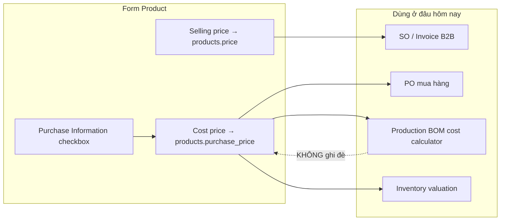

# Hiện trạng form Product — Pricing, Purchase Information & Product Type

**Cập nhật:** 2026-05-27  
**Mục đích:** Tóm tắt **trước khi triển khai** các tính năng mới (BOM → FG cost, v.v.) — tránh nhầm checkbox **Purchase Information** với logic giá bán / giá vốn theo loại sản phẩm.  
**Đối tượng:** PM, Finance, Dev  
**Màn hình:** Inventory → Products → Add / Edit Product  
**Code chính:** `Modules/Purchase/Resources/views/purchase-products/partials/product-form-fields.blade.php`, `App\Enums\ProductType`

**Doc liên quan**

| File                                                                                               | Vai trò                                  |
| -------------------------------------------------------------------------------------------------- | ---------------------------------------- |
| [`20_BOM_FG_COST_SYNC_IMPLEMENTATION_PLAN_VI.md`](./20_BOM_FG_COST_SYNC_IMPLEMENTATION_PLAN_VI.md) | Kế hoạch sync cost FG từ BOM (chưa code) |
| [`../FUNC_LOGIC/PRODUCTION_PRODUCT_TYPES_VI.md`](../FUNC_LOGIC/PRODUCTION_PRODUCT_TYPES_VI.md)     | Loại SP & BOM / Production               |
| [`P2_PRODUCT_UOM_KIOTVIET_PLAN_VI.md`](./P2_PRODUCT_UOM_KIOTVIET_PLAN_VI.md)                       | UOM đa đơn vị                            |

---

## 1. Tóm tắt 30 giây

| Câu hỏi                                                | Trả lời (hiện tại)                                                 |
| ------------------------------------------------------ | ------------------------------------------------------------------ |
| Checkbox **Purchase Information** điều khiển gì?       | Chỉ **hiện / ẩn ô Cost price** trên form — **không** liên quan BOM |
| Loại nào **không có** Selling price trên form?         | **Raw Material**, **Semi Finished**                                |
| Loại nào **có** Selling price?                         | **Manufactured Product (goods)**, **Service**                        |
| Loại nào **không có** Cost price?                      | **Service** (ẩn Purchase Information + Cost price)                     |
| BOM có ghi đè Cost price trên Product?                 | **Không** — cost BOM chỉ tính runtime / copy sang báo giá          |
| Create product mặc định checkbox Purchase Information? | **Bật (tick)**                                                     |

---

## 2. Checkbox **Purchase Information** (đã có sẵn)

### 2.1 Ý nghĩa nghiệp vụ

- **Bật (tick):** Sản phẩm **có khai báo giá vốn** trên catalog → hiện field **Cost price**; khi lưu, `purchase_price` bắt buộc (validation server).
- **Tắt (bỏ tick):** **Ẩn** Cost price trên form → lưu `purchase_information = 0`, `purchase_price = null`.

### 2.2 Hành vi UI / JS

| Trạng thái checkbox | Cost price trên form                 | Selling price                                                     |
| ------------------- | ------------------------------------ | ----------------------------------------------------------------- |
| Tick                | Hiện (class `.purchase_information`) | **Không** bị checkbox này ẩn — phụ thuộc **Product Type** (mục 3) |
| Bỏ tick             | Ẩn                                   | Giữ nguyên theo type                                              |

- **Mặc định khi tạo mới:** tick sẵn (`$purchaseInfoChecked = true` trong Blade).
- **JS:** `purchase-products/ajax/create.blade.php` và `edit.blade.php` — `#purchase_information` change → add/remove `d-none` trên `.purchase_information`.
- **Field DB:** `products.purchase_information` (0/1), `products.purchase_price`.

### 2.3 Validation & lưu DB

| Field form           | Cột DB                          | Ghi chú                                       |
| -------------------- | ------------------------------- | --------------------------------------------- |
| Selling price        | `products.price`                | Giá bán catalog / SO / Invoice                |
| Cost price           | `products.purchase_price`       | Giá vốn / PO mua / đầu vào tính BOM component |
| Purchase Information | `products.purchase_information` | Flag có theo dõi cost trên catalog            |

**Server** (`StorePurchaseProductRequest` / `UpdatePurchaseProductRequest`):

- `purchase_price` → `required_if:purchase_information,1`
- `selling_price` → required **trừ** loại cost-only (Raw Material, Semi Finished)

**Controller** (`PurchaseProductController`): với Raw Material / Semi Finished → luôn lưu `price = null` (bỏ selling price dù client gửi).

### 2.4 ⚠️ Không nhầm với **Cost from BOM** (chưa triển khai)

|                  | **Purchase Information** (hiện tại) | **Cost from BOM** (P1 — plan only)             |
| ---------------- | ----------------------------------- | ---------------------------------------------- |
| Mục đích         | Show/hide **nhập tay** Cost price   | Cost FG **read-only từ BOM**, sync khi lưu BOM |
| Liên quan BOM    | **Không**                           | **Có**                                         |
| Khi tắt checkbox | Ẩn cost                             | _(chưa có — không dùng checkbox này)_          |

Chi tiết: [`20_BOM_FG_COST_SYNC_IMPLEMENTATION_PLAN_VI.md` §2.3](./20_BOM_FG_COST_SYNC_IMPLEMENTATION_PLAN_VI.md).

---

## 3. Bảng Product Type × Pricing (hiện trạng code)

Nhãn UI lấy từ form Products (`ProductType::label()`).

| #   | Nhãn UI (EN)             | `type` DB       | Selling price trên form | Cost price (khi tick Purchase Information)      | UOM đa đơn vị                     | Ghi chú                                                                               |
| --- | ------------------------ | --------------- | ----------------------- | ----------------------------------------------- | --------------------------------- | ------------------------------------------------------------------------------------- |
| 1   | **Manufactured product** | `goods`         | **Có** — bắt buộc       | **Có** — bắt buộc nếu tick Purchase Information | Không                             | Thành phẩm / đầu ra BOM. Ảnh PM: type = Manufactured Product → thấy cả Selling + Cost |
| 2   | **Raw Material**         | `raw_material`  | **Không** — ẩn          | **Có** — bắt buộc nếu tick Purchase Information | **Có** — cột giá = **Cost price** | NVL; `price` luôn `null` khi lưu                                                      |
| 3   | **Semi Finished**        | `semi_finished` | **Không** — ẩn          | **Có** — bắt buộc nếu tick Purchase Information | **Có** — cột giá = **Cost price** | BTP / WIP; cùng UX cost-only như Raw Material (2026-05-27)                            |
| 4   | **Packaging**            | `packaging`     | **Không** — ẩn          | **Có** — bắt buộc nếu tick Purchase Information | Không                             | Bao bì BOM; cost-only như NVL                                                           |
| 5   | **Service**              | `service`       | **Có** — bắt buộc       | **Không** — ẩn checkbox + cost                  | Không                             | Chỉ giá bán; `purchase_price` luôn null khi lưu                                         |

### 3.1 Ma trận nhanh — có Selling price?

```
                    Selling price    Cost price (nếu tick Purchase Information)
goods               ✅ Có            ✅ Có
raw_material        ❌ Không         ✅ Có
semi_finished       ❌ Không         ✅ Có
packaging           ❌ Không         ✅ Có
service             ✅ Có            ❌ Không (ẩn)
```

**Cost-only types** (ẩn selling price): `ProductType::costOnlyPurchasePricingValues()` → `raw_material`, `semi_finished`, `packaging`.

**Sell-only type** (ẩn cost / Purchase Information): `ProductType::sellOnlyPurchasePricingValues()` → `service`.

---

## 4. Alternate UOM (đơn vị quy đổi)

Chỉ **Raw Material** và **Semi Finished** có section **Units of measure** trên form.

| Product type                    | Section UOM | Cột giá trên bảng UOM | Cột “For sale”                       | Điều kiện thêm dòng UOM                                      |
| ------------------------------- | ----------- | --------------------- | ------------------------------------ | ------------------------------------------------------------ |
| `raw_material`, `semi_finished` | Hiện        | **Cost price**        | Ẩn; `for_sale` luôn `false` khi sync | Base unit + **Cost price** > 0 (+ tick Purchase Information) |
| `goods`, `packaging`, `service` | Ẩn          | —                     | —                                    | —                                                            |

Code: `ProductType::supportsAlternateUnitConversions()`, `resources/js/purchase-product-unit-conversions.js`.

---

## 5. Luồng dữ liệu giá (baseline — chưa sync BOM)



- **SO / Invoice:** dùng **giá bán** (`products.price` / line price) — **không** dùng BOM cost.
- **BOM cost:** tính từ `purchase_price` (và UOM conversion) của **component** — **không** tự cập nhật cost FG (`goods`).

---

## 6. Ví dụ theo ảnh PM (Manufactured Product)

Khi chọn **Manufactured Product** (`goods`) như screenshot Add Products:

1. **Purchase Information** — tick (mặc định).
2. **Selling price** — hiện, bắt buộc (\*).
3. **Cost price** — hiện, bắt buộc khi tick Purchase Information (\*).
4. **Wholesale / Employee price** — luôn hiện (tùy chọn).
5. **Không** có section UOM.

Đổi type sang **Raw Material** hoặc **Semi Finished** → Selling price **biến mất**; Cost price vẫn phụ thuộc checkbox Purchase Information; section UOM xuất hiện với cột Cost.

---

## 7. File / class tham chiếu

| Khu vực                     | Path                                                                                                  |
| --------------------------- | ----------------------------------------------------------------------------------------------------- |
| Enum product type           | `app/Enums/ProductType.php`                                                                           |
| Form pricing + checkbox     | `Modules/Purchase/Resources/views/purchase-products/partials/product-form-fields.blade.php`           |
| Toggle theo type (JS)       | `Modules/Purchase/Resources/views/purchase-products/partials/product-type-dependent-fields.blade.php` |
| Toggle Purchase Information | `Modules/Purchase/Resources/views/purchase-products/ajax/create.blade.php`, `edit.blade.php`          |
| UOM section                 | `Modules/Purchase/Resources/views/purchase-products/partials/product-unit-conversions.blade.php`      |
| UOM JS                      | `resources/js/purchase-product-unit-conversions.js` → bundle `public/js/custom.js`                    |
| Validation                  | `Modules/Purchase/Http/Requests/Product/StorePurchaseProductRequest.php`                              |
| Persist                     | `Modules/Purchase/Http/Controllers/PurchaseProductController.php`                                     |
| UOM sync                    | `Modules/Warehouse/Services/ProductUnitConversionSyncService.php`                                     |
| Tests                       | `tests/Unit/ProductTypeTest.php`, `tests/Feature/ProductUnitConversionSyncTest.php`                   |

---

## 8. Gap / hướng triển khai tiếp (chưa làm)

| Gap                                  | Ghi chú                                                                            |
| ------------------------------------ | ---------------------------------------------------------------------------------- |
| FG cost ≠ BOM cost                   | `goods.purchase_price` nhập tay; BOM tính riêng — xem plan P1                      |
| Checkbox Purchase Information vs BOM | **Không** tái sử dụng — cần flag riêng “Cost from BOM” cho FG                      |

---

_Tài liệu mô tả **hiện trạng code** tại thời điểm cập nhật; khi merge tính năng BOM cost sync, cập nhật mục 2.4, 5 và 8._
