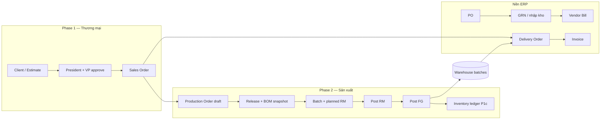
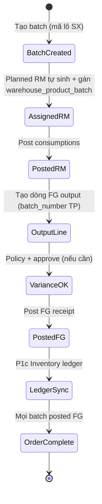

# Biomixing — Luồng nghiệp vụ chuẩn (LIVE DOC)

| Thuộc tính                | Giá trị                                                                                                                                   |
| ------------------------- | ----------------------------------------------------------------------------------------------------------------------------------------- |
| **Vai trò**               | **Nguồn sự thật nghiệp vụ (SSOT)** cho toàn bộ pilot Biomixing — đọc trước khi code, vá lỗi, UAT, demo                                    |
| **Cập nhật**              | 2026-05-24                                                                                                                                |
| **Không thay thế**        | Playbook kỹ thuật (`BIOMIXING_PLAYBOOK_P0P1_VI.md`), khái niệm (`BIOMIXING_FLOW_CONCEPTS_VI.md`) — file này là **luồng bước–cửa–tồn kho** |
| **Bắt buộc khi đổi code** | Mỗi PR/sprint chạm nghiệp vụ Production / Estimate / Warehouse pilot → **cập nhật mục tương ứng + § Changelog** dưới đây                  |

**Quy tắc maintainer (tránh lặp lỗi):**

1. Thêm/bớt bước → sửa diagram + bảng bước + cột «Tồn kho / SSOT».
2. Đổi config (`.env`, `Modules/*/Config`) → cập nhật § Cấu hình.
3. Vá bug nghiệp vụ → ghi 1 dòng changelog + link epic (`15_*`, `16_*`, …).
4. Không copy diagram sang `PROJECT BIOMIXING/` — chỉ **link** file này.

**Liên kết vận hành:** [`BIOMIXING_DOC_HUB_VI.md`](./BIOMIXING_DOC_HUB_VI.md) · [`P0_MINI_UAT_CHECKLIST_BIOMIXING_VI.md`](./P0_MINI_UAT_CHECKLIST_BIOMIXING_VI.md) · [`BIOMIXING_UAT_AND_TEST_GUIDE_VI.md`](./BIOMIXING_UAT_AND_TEST_GUIDE_VI.md)

---

## 0. Sơ đồ tổng thể (E2E pilot)

**Mốc phase PM:** SO hợp lệ từ Estimate đã duyệt → bắt đầu planning/sản xuất.

---

## 1. Phase 1 — Báo giá OEM → Sales Order

### 1.1 Luồng chuẩn

| #   | Bước nghiệp vụ               | Actor     | Cửa / route (gợi ý)                 | Cửa cứng (gate)                             | Tồn kho   |
| --- | ---------------------------- | --------- | ----------------------------------- | ------------------------------------------- | --------- |
| 1.1 | Nhận yêu cầu khách           | Sales     | Estimate create                     | —                                           | Không đổi |
| 1.2 | Nhập dòng + BOM trên báo giá | Sales     | Estimate edit, `estimate_bom_lines` | —                                           | Không đổi |
| 1.3 | Gửi duyệt President          | Sales     | Workflow estimate                   | —                                           | Không đổi |
| 1.4 | Duyệt President              | President | `approve_estimate_*`                | Chưa VP → chưa convert                      | Không đổi |
| 1.5 | Duyệt VP (giá/margin)        | VP        | VP review                           | —                                           | Không đổi |
| 1.6 | Chuyển Sales Order           | Sales     | Convert estimate → SO               | `Estimate::isCommercialConversionAllowed()` | Không đổi |
| 1.7 | (Tuỳ chọn) PDF / email       | —         | PDF partial BOM                     | —                                           | —         |

**Bật phase 1:** Module setting `estimates_phase1_review` = active cho tenant.

**UAT:** Luồng **A** — `P0_MINI_UAT_CHECKLIST` A1–A4 · TC-P0-08-A.

**Test tự động:** `.\scripts\test.ps1 phase1`

### 1.2 Lỗi thường gặp (đã biết)

| Triệu chứng       | Nguyên nhân               | Xử lý                         |
| ----------------- | ------------------------- | ----------------------------- |
| Không tạo được SO | Estimate chưa duyệt đủ    | Hoàn tất bước 1.4–1.5         |
| PDF không có BOM  | Template chưa bật partial | Xem gap status PDF 2026-05-20 |

---

## 2. Phase 2 — Planning: Lệnh sản xuất

### 2.1 Luồng chuẩn (trước khi vào xưởng)

| #    | Bước                      | Điều kiện              | Hành động hệ thống                                                                       | Ghi chú                                                                                                       |
| ---- | ------------------------- | ---------------------- | ---------------------------------------------------------------------------------------- | ------------------------------------------------------------------------------------------------------------- |
| 2.1  | Tạo SP FG + RM (Products) | SKU tồn tại            | FG = `goods` (Manufactured product); NL = `raw_material` / `packaging` / `semi_finished` | Xem [`FUNC_LOGIC/PRODUCTION_PRODUCT_TYPES_VI.md`](../FUNC_LOGIC/PRODUCTION_PRODUCT_TYPES_VI.md) · SOP mục 0–2 |
| 2.2  | Tạo BOM master            | FG đã có               | `/account/production/boms`                                                               | Dropdown tách FG vs component                                                                                 |
| 2.3  | Tạo lệnh SX               | BOM (tuỳ)              | `/account/production/orders/create`                                                      | Chọn `rm_warehouse_id`, `fg_warehouse_id`, `planned_quantity`                                                 |
| 2.3b | (Tuỳ) Từ SO               | SO đã chốt             | Nút từ SO → prefill `sales_order_id`, SL, BOM                                            | P1-1 / P1-4                                                                                                   |
| 2.4  | Xem tổng NL               | Lệnh có BOM / snapshot | Bảng `ProductionOrderMaterialRequirementsSummary`                                        | SL kế hoạch × BOM (+ % hao hụt)                                                                               |
| 2.5  | Shortfall                 | Thiếu tồn RM           | Link tạo PO (nếu có quyền Purchase)                                                      | P1-2                                                                                                          |
| 2.6  | **Release**               | Draft, có BOM + dòng   | Snapshot → `production_order_bom_snapshot_items` + **reserve RM** (FEFO)                 | Chặn nếu thiếu `available`; xem `PRODUCTION_OPERATIONS_LIVE_VI.md` §2                                         |
| 2.6b | Cancel Released           | Chưa post RM/FG        | **Release** reservation Production                                                       | Draft cancel: không có reserve để trả                                                                         |

**Trạng thái lệnh:** `draft` → `released` → `in_progress` → `completed`.

**Reserve vs post:** Release = giữ chỗ tồn (`reserved_quantity`); nút vàng **Deduct raw materials** = trừ tồn thật + **consume** reserve khi mọi batch đã post RM.

**UAT:** — (nằm trong demo batch).

---

## 3. Phase 2 — Thực thi lô (Batch) — LUỒNG CỐT LÕI

Đây là chuỗi **bắt buộc đúng thứ tự**; bỏ bước → lỗi post hoặc tồn sai.

### 3.1 Bảng bước chi tiết

| #    | Bước UI (checklist 4 bước trên batch) | Route / action                  | Tiên quyết                      | Tồn kho (SSOT)                                                                        | Inventory list                        |
| ---- | ------------------------------------- | ------------------------------- | ------------------------------- | ------------------------------------------------------------------------------------- | ------------------------------------- |
| 3.1  | Tạo / mở batch                        | Release → batch; `batches.show` | Released; snapshot trên lệnh    | **Tự** insert `production_batch_consumptions` (`PRODUCTION_OPERATIONS_LIVE_VI.md` §7) | —                                     |
| 3.2  | **Gán lô RM**                         | Assign batch per consumption    | Đã có dòng planned RM           | **Không** tăng reserve (reserve đã ở Release)                                         | —                                     |
| 3.3  | **Post RM**                           | `post-consumptions`             | Đã gán lô                       | **Trừ** `warehouse_product_batches` + movement                                        | Không bắt buộc                        |
| 3.4  | Thêm **FG output**                    | `outputs.store`                 | Đã post RM                      | —                                                                                     | —                                     |
| 3.4a | **Variance**                          | Cột approval                    | Xem § 3.2 FG policy             | —                                                                                     | —                                     |
| 3.5  | **Post FG**                           | `post-fg-receipt`               | Policy OK; approve nếu bắt buộc | **Cộng** warehouse batch FG                                                           | **P1c:** `purchase_stock_adjustments` |
| —    | _(Legacy)_ Sinh planned RM thủ công   | `applyPlannedFromBomSnapshot`   | Chỉ khi bật lại config Step 1   | —                                                                                     | —                                     |
| 3.7  | Trace                                 | `batches/{id}/trace`            | Đã post                         | Link P↔W                                                                              | —                                     |

**`batch_number` trên FG:** mã **lô thành phẩm** (vd. `PB-20260524-01`), **không** phải SKU. Tìm trên Inventory theo **tên SP / SKU**.

**`rm_warehouse_id` / `fg_warehouse_id`:** kho **logic WMS**, không phải “vị trí xưởng vật lý”.

### 3.2 Chính sách FG & variance approval

| Trạng thái UI (cột Variance approval) | Điều kiện                                | Hành động user                       |
| ------------------------------------- | ---------------------------------------- | ------------------------------------ |
| **Không yêu cầu**                     | `outputRequiresVarianceApproval` = false | Post FG trực tiếp                    |
| **Chờ phê duyệt**                     | Cần approve + chưa `approved_at`         | Approve → Post FG                    |
| **Đã phê duyệt**                      | `approved_at` set                        | Post FG                              |
| (Sau post)                            | `posted_at` set                          | Không hiện «Chờ» nếu không cần duyệt |

**Config:** `production.phase2.enforce_variance_approval` · policy company: `/account/production/fg-quantity-policy` (controlled / strict / flexible).

**Code:** `ProductionFgQuantityPolicyService::outputRequiresVarianceApproval`, `outputVarianceApprovalUiState` (UX-008).

**UAT:** P0-02 · Luồng D (UOM) · Luồng E (Inventory).

### 3.3 Đồng bộ tồn sau Post FG (P1c)

| Sổ                                   | Bảng / màn hình                                               | Cập nhật khi                                |
| ------------------------------------ | ------------------------------------------------------------- | ------------------------------------------- |
| Warehouse (SSOT vật lý lô)           | `warehouse_product_batches`, movements                        | Post FG                                     |
| Purchase Inventory (ledger)          | `purchase_stock_adjustments`, `purchase_inventory_adjustment` | Post FG — `ProductionFgInventoryLedgerSync` |
| Products list `withSum('inventory')` | Cùng ledger                                                   | Sau P1c                                     |

**Backfill dữ liệu cũ:** `php artisan production:backfill-fg-inventory-ledger`

**Epic:** `PRODUCTION_OPERATIONS_LIVE_VI.md` §2 (P1c)

### 3.4 Post RM — quy đổi UOM

BOM có thể nhập **g** trên SP base **kg** → post phải trừ **0,1 kg**, không **100 kg**.

**Epic:** `PRODUCTION_OPERATIONS_LIVE_VI.md` §2 + `FUNC_BUG/PRODUCTION_RM_OUTBOUND_UOM_VI.md` — Fixed 2026-05-20.

**UAT:** Luồng D.

---

## 4. Nền platform — Mua · Bán · Kho (bắt buộc pilot)

### 4.1 Luồng B — SO → DO → Invoice

| #   | Bước              | Tồn (theo `warehouse.sales_outbound_mode`)  |
| --- | ----------------- | ------------------------------------------- |
| B1  | SO confirmed      | Thường chưa trừ                             |
| B2  | DO reserve / ship | `shipment` vs `invoice` — xem config        |
| B3  | Ship              | Trừ FG (đã có từ Production hoặc nhập khác) |
| B4  | Invoice           | Tài chính; không đổi tồn (thường)           |

**Quality lock (tuỳ bật):** `production.phase2.enforce_quality_lock_sales_do` — chặn ship nếu lệnh SX chưa complete.

**UAT:** Luồng B · TC-P0-08-B.

### 4.2 Luồng C — PO → GRN → Bill

| #   | Bước              | Tồn                                                                                                         |
| --- | ----------------- | ----------------------------------------------------------------------------------------------------------- |
| C1  | PO + nhận hàng    | Inbound RM                                                                                                  |
| C2  | Batch lô (nếu có) | `warehouse_product_batches`                                                                                 |
| C3  | Vendor bill       | Khớp PO/GRN                                                                                                 |
| C4  | Tránh nhập đôi    | **Một** canonical inbound: `inbound_from_purchase_order_delivered` / `inbound_from_delivery_order_received` |

**UAT:** Luồng C · TC-P0-08-C.

### 4.3 Opening stock vs warehouse

Thêm SP với **Opening stock** trên form Purchase ≠ tự có trên kho cho đến khi sync P1.

**Epic:** [`13_OPENING_STOCK_VS_WAREHOUSE_STOCK_VI.md`](./13_OPENING_STOCK_VS_WAREHOUSE_STOCK_VI.md) · backfill `warehouse:backfill-opening-stock-to-default`.

---

## 5. Trace hai chiều (P0-05)

| Chiều | Điểm bắt đầu             | Đích                                  |
| ----- | ------------------------ | ------------------------------------- |
| P → W | Production batch → Trace | Link `warehouse-product-batches/{id}` |
| W → P | Warehouse batch detail   | Link `production.batches.trace`       |

**UAT:** TC-P0-05-01…06 · `P0_05_TRACE_BIDIRECTIONAL_UAT_CHECKLIST.md`.

---

## 6. Cấu hình pilot (tham chiếu nhanh)

| Key                                               | File                                   | Ý nghĩa nghiệp vụ                          |
| ------------------------------------------------- | -------------------------------------- | ------------------------------------------ |
| `estimates_phase1_review`                         | Module settings                        | Bật Phase 1 Biomixing                      |
| `production` module                               | Module settings                        | Bật menu Production                        |
| `production.phase2.enforce_variance_approval`     | `Modules/Production/Config/config.php` | Bắt approve trước post FG khi vượt ngưỡng  |
| `production.phase2.yield_uom_shadow_enabled`      | Cùng                                   | **OFF** trên pilot — không dùng cột shadow |
| `production.phase2.enforce_quality_lock_sales_do` | Cùng                                   | Chặn ship DO                               |
| `warehouse.sales_outbound_mode`                   | `Modules/Warehouse/Config/config.php`  | shipment vs invoice                        |
| `warehouse.inbound_from_purchase_order_delivered` | `.env` (pilot local)                   | **true** — nhập qua PO/GRN                 |
| `warehouse.inbound_from_delivery_order_received`  | `.env` (pilot local)                   | **false** — tắt nhập DO để tránh double    |
| FG policy per company                             | DB `production_company_fg_policies`    | controlled 5% typical                      |

---

## 7. Ma trận test ↔ luồng

| Luồng      | Checklist       | Test tự động (gợi ý)                                                                |
| ---------- | --------------- | ----------------------------------------------------------------------------------- |
| A          | P0 mini A       | `phase1` script                                                                     |
| B, C       | P0 mini B, C    | `P0BiomixingAutomatedEvidenceTest`                                                  |
| D          | P0 mini D       | `ProductionPostingServiceTest` + UOM                                                |
| E          | P0 mini E       | `ProductionFgInventoryLedgerSyncTest`                                               |
| Batch core | Demo runbook §2 | `ProductionPostingServiceTest`, routes readiness                                    |
| Variance   | P0-02           | `ProductionVarianceApprovalPermissionTest`, `ProductionFgQuantityPolicyServiceTest` |
| Trace      | P0-05           | Evidence test + UAT checklist                                                       |

---

## 8. Chưa trong pilot (không ghi vào luồng chuẩn trên)

| Hạng mục                                      | Phase   | Ghi chú                                        |
| --------------------------------------------- | ------- | ---------------------------------------------- |
| CCP / HACCP automation                        | 3+      | `BIOMIXING_GAP_STATUS_VI.md`                   |
| Receiving QC GRN đầy đủ                       | 3+      | —                                              |
| Multi-batch chia RM khác equal-split          | 2+      | Backlog                                        |
| Reverse movement sau post                     | —       | MVP chỉ idempotent skip                        |
| Inventory list = warehouse only (một SSOT UI) | backlog | `13_OPENING_STOCK_*`, `WAREHOUSE_MASTER_GUIDE` |

---

## 9. Changelog (LIVE — cập nhật mỗi đợt)

| Ngày       | Thay đổi luồng                                                                                         | File / PR liên quan                                     |
| ---------- | ------------------------------------------------------------------------------------------------------ | ------------------------------------------------------- |
| 2026-05-27 | Ghi **reserve tại Release**, gán lô không reserve, cancel release reservation (đồng bộ plan đã retire) | `PRODUCTION_OPERATIONS_LIVE_VI.md`, `LEGACY_ARCHIVE.md` |
| 2026-05-25 | Pilot warehouse: `.env` inbound PO-only; kho UAT **LOCK-UAT** / **SCRAP-UAT**; WUP-01/04 Pass mini-UAT | `P0_MINI_UAT_CHECKLIST`, `04_WH_RUNBOOK` §2.1.1         |
| 2026-05-24 | **Tạo LIVE DOC** — E2E, Phase 1, batch 4 bước hiện tại, P1c, variance UI states                        | File này                                                |
| 2026-05-24 | UX-008: cột approval hiển thị «Không yêu cầu» thay vì «Chờ» khi không cần approve                      | `ProductionFgQuantityPolicyService`, batch show         |
| 2026-05-23 | P1c: Post FG → Purchase Inventory ledger + backfill                                                    | `16_*`                                                  |
| 2026-05-20 | Post RM UOM `convertToBase`                                                                            | `15_*`                                                  |
| 2026-05-20 | P0-3…P1-4 Production UX (tổng NL, SO→lệnh; planned-lines step cũ nay tự sinh, checklist hiện tại 4 bước) | GAP_STATUS                                              |

---

_Cuối mỗi sprint: PM/BA rà §9 + đối chiếu `BIOMIXING_GAP_STATUS_VI.md`. Dev: cập nhật file này **trước khi merge** nếu đổi thứ tự bước, gate, hoặc SSOT tồn._
