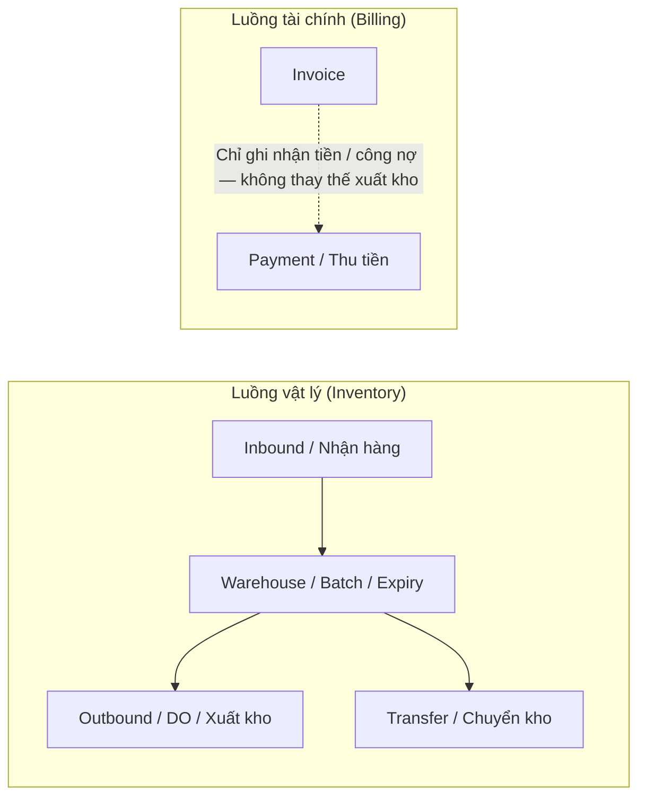
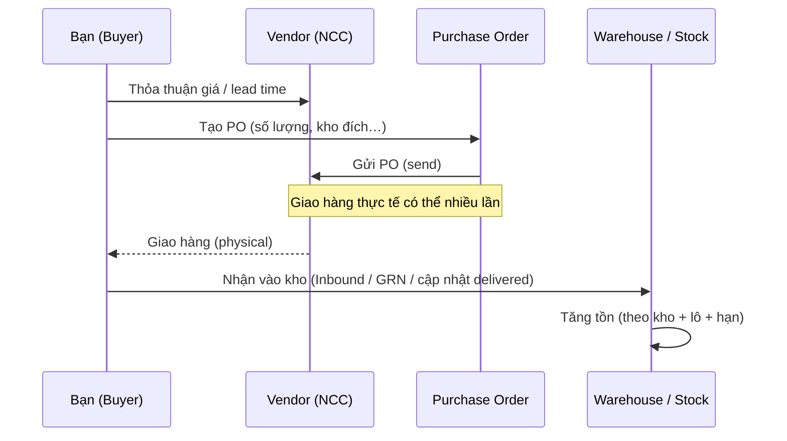
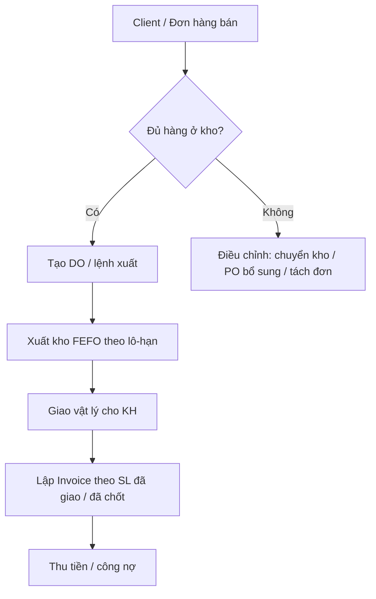

# Hướng dẫn nghiệp vụ B2B (ERP): Client → PO → Nhận hàng / DO → Invoice / Billing

Tài liệu này giúp người **không chuyên B2B** hiểu **vai trò từng chứng từ**, **thứ tự vận hành**, và **mối quan hệ** trong ERP. Hệ thống của bạn có module Purchase, Warehouse, Invoice — luồng cụ thể có thể khác nhẹ theo cấu hình, nhưng **nguyên tắc chung** giống nhau.

---

## 1) Khái niệm nhanh (tiếng Việt + ý chính)

| Thuật ngữ                     | Ý nghĩa đơn giản                                                                                           |
| ----------------------------- | ---------------------------------------------------------------------------------------------------------- |
| **Client (KH)**               | Đối tác mua hàng của bạn (công ty / người đại diện).                                                       |
| **Product / SKU**             | Hàng hóa bán — tồn kho gắn với **kho + lô + hạn** (multi-warehouse).                                       |
| **PO (Purchase Order)**       | **Đơn đặt hàng mua** từ nhà cung cấp (vendor): bạn **đặt** hàng, chưa chắc đã nhận đủ.                     |
| **Nhận hàng / GRN / Inbound** | Xác nhận **hàng đã vào kho** (thường theo PO hoặc phiếu nhận). **Đây là chỗ làm tăng tồn kho** (nhập kho). |
| **DO (Delivery Order)**       | **Lệnh giao hàng / xuất kho** (outbound): hàng **ra khỏi kho** để giao cho KH hoặc chuyển đi.              |
| **Invoice (Hóa đơn bán)**     | **Công nợ / thanh toán** với khách: ghi nhận **giá trị bán**, **thu tiền**.                                |
| **Billing**                   | Tổng quát: **lập hóa đơn + theo dõi thanh toán** (paid / unpaid / partial).                                |

**Quan trọng:** Trong thiết kế bạn yêu cầu: **Invoice không tự trừ kho** — tồn thay đổi theo **nhận hàng / xuất kho / chuyển kho** (fulfillment), không theo “phát hành hóa đơn”.

---

## 2) Hai dòng chảy: **Vật lý (kho)** vs **Tài chính (hóa đơn)**

- **Kho** trả lời câu hỏi: _Còn bao nhiêu, ở kho nào, lô nào?_
- **Hóa đơn** trả lời: _Bán bao nhiêu tiền, khách nợ / đã trả bao nhiêu?_

---

## 3) Luồng mua hàng (Purchase → Nhập kho)

Điển hình B2B mua từ vendor:

**Ghi nhớ:** PO **“đặt hàng”**; chỉ khi có bước **nhận vào kho** thì tồn **tăng** đúng nghĩa vận hành (trừ khi doanh nghiệp cho phép “ước lượng” — thường không khuyến nghị).

---

## 4) Luồng bán hàng (Client → Xuất kho → Invoice)

- **DO / xuất kho** = bằng chứng **hàng đã ra kho**.
- **Invoice** = bằng chứng **giá trị cần thu** — nên **khớp** với số lượng đã giao (theo chính sách công ty).

---

## 5) PO (mua) vs DO (giao) — dễ nhầm

|                   | PO                                            | DO                                           |
| ----------------- | --------------------------------------------- | -------------------------------------------- |
| Phía nào          | Bạn **mua** từ NCC                            | Bạn **giao** cho KH (hoặc xuất nội bộ)       |
| Ảnh hưởng tồn     | Tăng khi **nhận** vào kho                     | Giảm khi **xuất** khỏi kho                   |
| Liên quan Invoice | Thường là **bill nhà cung cấp** (khác module) | Liên quan **invoice bán** nếu giao cho khách |

_(Trong codebase có thể dùng `delivery_orders` cho nhiều ngữ cảnh — cần xác định rõ inbound vs outbound ở Phase module integration.)_

---

## 6) Thao tác nhập liệu trên UI (góc nhìn người dùng)

1. **Master data**
    - Tạo **Kho**, **Sản phẩm/SKU**, (tuỳ chọn) **kho mặc định** trên Client.
2. **Mua hàng**
    - Tạo **PO** → chọn vendor, dòng hàng, **kho nhận** (nếu có).
    - Khi hàng về: cập nhật trạng thái **đã giao / delivered** (hoặc màn nhận hàng tương đương) → hệ thống **nhập kho**.
3. **Tồn & điều chỉnh**
    - Xem tồn theo kho; **chuyển kho**; điều chỉnh thủ công (được phép trong phạm vi quyền).
4. **Bán & tài chính**
    - Tạo đơn bán / DO xuất kho → sau đó **Invoice** theo số lượng đã giao (policy).

---

## 7) Phần “Chưa rõ / cần workshop” (nên hỏi stakeholder)

- **Reservation** (giữ hàng khi chưa xuất): bật khi nào, giữ bao lâu?
- **FEFO** khi **thiếu ngày hạn**: xử lý theo lô, FIFO, hay ưu tiên lô “unknown” sau cùng? (Hệ thống hiện có default kỹ thuật — cần xác nhận nghiệp vụ.)
- **PO line** có **batch/expiry** hay chỉ nhập khi nhận hàng?

---

## 8) Liên kết với triển khai Multi-Warehouse (Craveva)

- Tồn chuẩn: **company + warehouse + product + batch + expiry**.
- Chuyển động: **inbound / outbound / transfer** (ledger).
- **Invoice** không trực tiếp trừ kho; trừ kho theo **nhận/xuất/chuyển**.

_Tài liệu này là hướng dẫn nghiệp vụ; chi tiết kỹ thuật nằm trong `FUNC_LOGIC/MAOLIN_MULTI_WAREHOUSE_ANALYSIS_AND_PLAN.md`._
