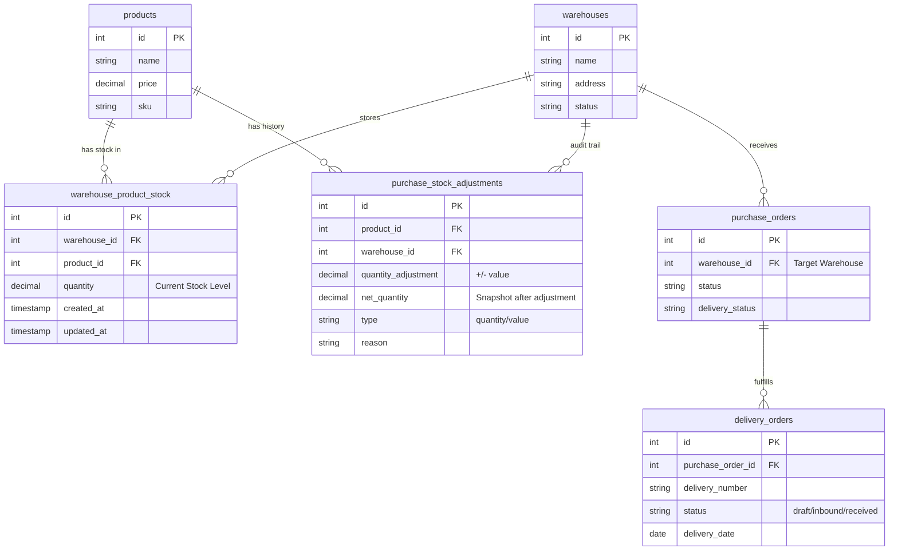
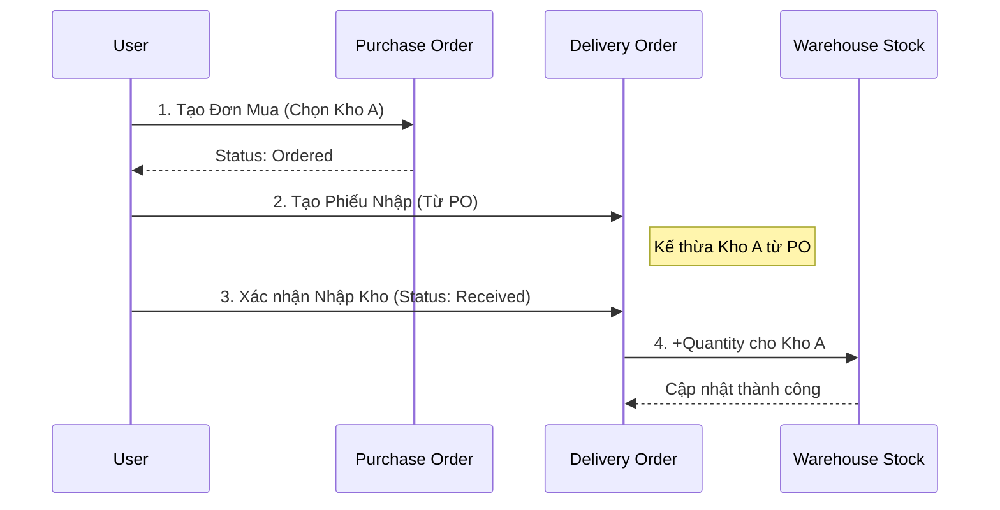

# Warehouse Logic & Entity Relationship Diagram (ERD)

## 1. Entity Relationship Diagram (ERD)

Mô hình dữ liệu tập trung vào việc quản lý tồn kho đa kho (Multi-Warehouse), trong đó `warehouse_product_stock` đóng vai trò là bảng trung gian lưu trữ số lượng tồn kho thực tế của từng sản phẩm tại từng kho.



### ASCII Representation

```text
+----------------+       1:N       +-------------------------+       N:1       +----------------+
|    PRODUCTS    |<--------------->| WAREHOUSE_PRODUCT_STOCK |<--------------->|   WAREHOUSES   |
+----------------+                 +-------------------------+                 +----------------+
| id (PK)        |                 | id (PK)                 |                 | id (PK)        |
| name           |                 | product_id (FK)         |                 | name           |
| sku            |                 | warehouse_id (FK)       |                 | address        |
| price          |                 | quantity (Current Qty)  |                 | status         |
+----------------+                 +-------------------------+                 +----------------+
        ^                                       ^
        | 1:N                                   |
        |                                       | (Syncs to)
        |                                       |
+------------------------------+                |
|  PURCHASE_STOCK_ADJUSTMENTS  |----------------+
+------------------------------+
| id (PK)                      |
| product_id (FK)              |
| warehouse_id (FK)            |
| quantity_adjustment (+/-)    |
| net_quantity (Snapshot)      |
| type (quantity/value)        |
+------------------------------+
```

## 2. Luồng Dữ Liệu (Data Flow)

### A. Nhập Hàng (Purchase Order)

1.  **Trigger**: Khi `PurchaseOrder` chuyển sang trạng thái `delivery_status = 'delivered'`.
2.  **Process**:
    - Hệ thống xác định `warehouse_id` từ đơn hàng.
    - Tạo bản ghi lịch sử trong `purchase_stock_adjustments` (ghi nhận việc tăng kho).
    - Cập nhật hoặc tạo mới bản ghi trong `warehouse_product_stock`:
        - `quantity = quantity + incoming_quantity`

### B. Điều Chỉnh Tồn Kho Thủ Công (Manual Adjustment)

1.  **Trigger**: Người dùng tạo phiếu điều chỉnh trong module Purchase -> Inventory.
2.  **Input**: Chọn Sản phẩm, Chọn Kho (`warehouse_id`), Nhập số lượng thực tế/điều chỉnh.
3.  **Process**:
    - Lưu phiếu điều chỉnh vào `purchase_inventory_adjustment`.
    - Lưu chi tiết từng sản phẩm vào `purchase_stock_adjustments` kèm `warehouse_id`.
    - Đồng bộ ngay lập tức sang `warehouse_product_stock`:
        - Nếu là thay đổi số lượng: Cập nhật `quantity` mới nhất cho cặp (Warehouse, Product).

### C. Nguyên Tắc "Single Source of Truth"

- **warehouse_product_stock**: Là nơi duy nhất để xem "Hiện tại kho A có bao nhiêu sản phẩm B?".
- **purchase_stock_adjustments**: Là nơi để xem "Tại sao kho A lại có số lượng đó? (Lịch sử biến động)".

## 3. Phân Tích Purchase Order & Delivery Order (Inbound)

### Mối quan hệ hiện tại

- **Purchase Order (PO)**: Đã có trường `warehouse_id`. Đây là nơi người dùng định nghĩa "Hàng này mua về sẽ nhập vào kho nào?".
- **Delivery Order (DO)**: Hiện tại là con của PO (`purchase_order_id`). Nó đóng vai trò xác nhận việc nhận hàng (Receiving).

### Khả năng liên kết Multi-warehouse

Hoàn toàn có thể liên kết chặt chẽ theo luồng sau:

1.  **Kế hoạch (Purchase Order)**:
    - User tạo PO, chọn `Warehouse A` (Target Warehouse).
    - Hệ thống hiểu: "Sắp có hàng về Kho A".

2.  **Thực thi (Delivery Order)**:
    - Khi hàng về, User tạo Delivery Order từ PO.
    - _Logic nâng cao_: Nếu muốn chia hàng về nhiều kho (ví dụ PO 100 cái, 50 về Kho A, 50 về Kho B), ta có thể thêm `warehouse_id` vào `DeliveryOrder` để ghi đè kho mặc định của PO.
    - Hiện tại: DO sẽ nhập hàng vào kho được chỉ định ở PO.

3.  **Kết quả (Stock Update)**:
    - Khi DO chuyển trạng thái `Received`:
        - Cộng tồn kho vào `warehouse_product_stock` của kho đích.
        - Ghi log vào `purchase_stock_adjustments`.

### Sơ đồ luồng Purchase -> Delivery -> Stock



## 4. Thiết Kế & Giải Thích (Design FAQ)

### Q1: Tại sao hệ thống có `Inventory` rồi mà vẫn cần `WarehouseProductStock`?

- **Hệ thống cũ ("Inventory" - `PurchaseInventory`)**: Thực chất tính năng này là "Điều chỉnh kho" (Stock Adjustment) nhưng code cũ đã lạm dụng nó để lưu "Số lượng tồn kho" bằng cách ghi đè dữ liệu. Điều này dẫn đến việc mất lịch sử và khó mở rộng cho đa kho.
- **Giải pháp mới (`WarehouseProductStock`)**: Chúng ta cần một bảng chuyên biệt để lưu **Số Dư Hiện Tại** (Snapshot).
    - Tách biệt "Trạng thái" (State - `WarehouseProductStock`) và "Giao dịch" (Transaction - `PurchaseStockAdjustment`).
    - Giúp truy vấn tồn kho cực nhanh mà không cần cộng trừ lại từ lịch sử.

### Q2: `PURCHASE_STOCK_ADJUSTMENTS` dùng để làm gì?

- Đây là bảng **chi tiết** của một phiếu Inventory.
- Ví dụ: Một phiếu kiểm kê ngày 20/01 (Inventory Header) có thể điều chỉnh 50 sản phẩm khác nhau. Bảng này sẽ chứa 50 dòng chi tiết đó.
- Trong hệ thống mới, bảng này đóng vai trò là **Audit Trail (Lịch sử)** để đối chiếu khi cần thiết, trong khi số lượng thực tế được lấy từ `WarehouseProductStock`.
