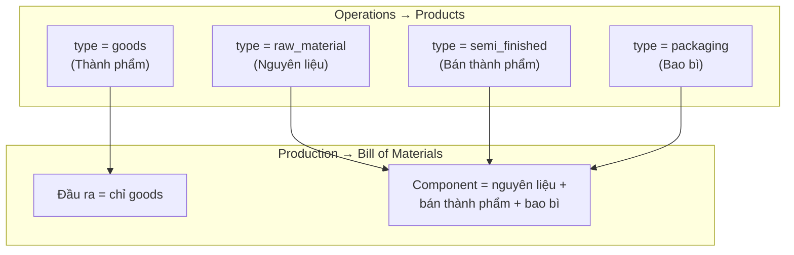

# Loại sản phẩm & Sản xuất / BOM (hướng dẫn vận hành)

**Đối tượng:** Planner, master data, kho, triển khai Biomixing  
**Cập nhật:** 2026-05-27  
**Code:** `App\Enums\ProductType`, `products.type`, scope `Product::forBomOutput()` / `forBomComponents()`

**Thuật ngữ (không viết tắt trên tài liệu khách):** [`PRODUCTION_TERMINOLOGY_CODE_VS_UI_VI.md`](./PRODUCTION_TERMINOLOGY_CODE_VS_UI_VI.md)

**Đọc cùng:** [`PROJECT BIOMIXING/PRODUCTION_MODULE_SOP_VI.md`](../PROJECT%20BIOMIXING/PRODUCTION_MODULE_SOP_VI.md)

---

## 0. Người mua vs tồn kho (hay nhầm)

| Loại UI        | `type`          | Người mua (SO/PO)   | Tồn / BOM                        |
| -------------- | --------------- | ------------------- | -------------------------------- |
| Finished Goods | `goods`         | Khách đặt SO        | Nhận SX, ship DO                 |
| Raw Material   | `raw_material`  | Mua NCC (PO)        | Tiêu hao BOM                     |
| Packaging      | `packaging`     | Mua NCC             | Tiêu hao nếu theo dõi SKU bao bì |
| Semi Finished  | `semi_finished` | Thường không bán SO | Chỉ khi dùng trong BOM/quy trình |
| Service        | `service`       | Có thể bán          | Không tồn                        |

**Packaging:** khách lẻ không «mua túi», nhưng xưởng vẫn mua NCC và trừ tồn. **BTP:** thường không bán SO; vẫn cần tồn nếu cất trung gian trong SX.

---

## 1. Vì sao phải chọn đúng loại?

Craveva **lọc dropdown** theo `products.type`. Chọn sai → sản phẩm **không xuất hiện** trên form BOM / lệnh SX, hoặc không trừ tồn đúng cách.

| Câu hỏi nghiệp vụ                              | Loại cần tạo                                    |
| ---------------------------------------------- | ----------------------------------------------- |
| Khách đặt / giao / bán là gì?                  | **Finished Goods** (`goods`) — thành phẩm       |
| Mua NCC, trộn, tiêu hao trong công thức?       | **Raw Material** (`raw_material`) — nguyên liệu |
| Hộp, túi, nhãn — trừ kho khi đóng gói?         | **Packaging** (`packaging`) — bao bì            |
| Bán thành phẩm trung gian dùng tiếp trong BOM? | **Semi Finished** (`semi_finished`)             |
| Dịch vụ, không có tồn?                         | **Service** — **không** dùng Production         |

---

## 2. Bảng loại sản phẩm (UI ↔ database)

| Nhãn trên form Products               | Giá trị DB `type` | Trong module Production                                                     |
| ------------------------------------- | ----------------- | --------------------------------------------------------------------------- |
| **Manufactured product** (thành phẩm) | `goods`           | **Đầu ra BOM** · thành phẩm trên lệnh SX · nhập kho thành phẩm sau khi post |
| **Raw Material** (nguyên liệu)        | `raw_material`    | **Dòng component BOM** · trừ tồn khi trừ nguyên liệu                        |
| **Semi Finished** (bán thành phẩm)    | `semi_finished`   | **Dòng component BOM** · trừ tồn nếu dùng trong công thức                   |
| **Packaging** (bao bì)                | `packaging`       | **Dòng component BOM** · trừ tồn khi đóng gói                               |
| **Service**                           | `service`         | **Không** có trong BOM / không stock                                        |

---

## 3. Quy tắc hệ thống (BOM & lệnh SX)

| Vai trò                              | Loại được phép                               | Màn hình                            |
| ------------------------------------ | -------------------------------------------- | ----------------------------------- |
| **Đầu ra** BOM                       | Chỉ `goods`                                  | Dropdown Manufactured product       |
| **Thành phẩm** trên lệnh (BOM-first) | Chỉ `goods`                                  | Tự điền từ BOM                      |
| **Component** (tiêu hao)             | `raw_material`, `semi_finished`, `packaging` | Dropdown component (nhóm theo loại) |
| **Service**                          | Không                                        | Không chọn trên BOM                 |

---

## 4. Thứ tự master data khuyến nghị (trước BOM)

1. **Nguyên liệu** (`raw_material`)
2. **Bao bì** (`packaging`) nếu theo dõi SKU
3. **Bán thành phẩm** (`semi_finished`) nếu có bước trung gian
4. **Thành phẩm** (`goods`)
5. **Nhập tồn** — `Add Inventory` đúng kho
6. **BOM** — chọn thành phẩm đầu ra → thêm component + định mức
7. **Lệnh SX** — chọn BOM trước

---

## 5. Pilot một bước (nguyên liệu → thành phẩm)

Nhiều pilot **không** dùng `semi_finished`:

- BOM: **nguyên liệu** (+ **bao bì** nếu cần)
- Đầu ra: **goods** (thành phẩm)

Phải tạo nguyên liệu đúng loại `raw_material` — không tạo thành phẩm rồi kéo vào dòng component.

---

## 6. Lỗi thường gặp

| Triệu chứng                                 | Nguyên nhân                                 | Cách sửa                                                                |
| ------------------------------------------- | ------------------------------------------- | ----------------------------------------------------------------------- |
| Không thấy SP trong dropdown **đầu ra** BOM | Type không phải `goods`                     | Đổi sang **Manufactured product**                                       |
| Không thấy NVL trong dropdown **component** | Type là `goods` hoặc `service`              | Tạo lại với **Raw Material** / Packaging / Semi Finished                |
| BOM lỗi “component must differ from output” | Cùng một product                            | Tách master thành phẩm và nguyên liệu riêng                             |
| Release / trừ NL báo thiếu tồn              | Chưa nhập tồn **kho nguyên liệu** trên lệnh | Add Inventory đúng kho                                                  |
| Nhầm SL lệnh (2) với định mức BOM (10)      | Hai khái niệm                               | SL lệnh = số **thành phẩm**; định mức = NVL **mỗi 1** đơn vị thành phẩm |

---

## 7. Liên kết tài liệu

- SOP: [`PROJECT BIOMIXING/PRODUCTION_MODULE_SOP_VI.md`](../PROJECT%20BIOMIXING/PRODUCTION_MODULE_SOP_VI.md)
- Tồn kho: [`PRODUCTION_OPERATIONS_LIVE_VI.md`](./PRODUCTION_OPERATIONS_LIVE_VI.md)
