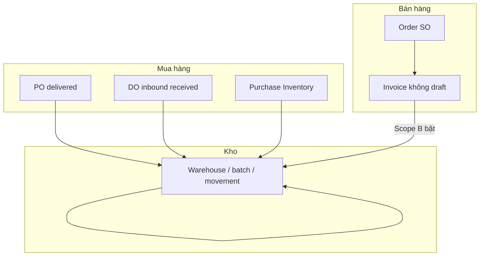

# Quy trình PO · DO · SO · Invoice · Warehouse (Craveva)

**Mục đích:** Một file **hướng dẫn nghiệp vụ + vận hành** theo thứ tự: mua (PO/DO), kho, bán (SO/Invoice), cấu hình.  
**Đối tượng:** PM, BA, vận hành, dev mới.  
**Cập nhật:** 2026-03-28

**Chi tiết kỹ thuật (class, bảng, observer):** [`SALES_PURCHASE_FLOW.md`](SALES_PURCHASE_FLOW.md)  
**Chỉ riêng module kho (điều chỉnh, chuyển, ledger):** [`WAREHOUSE_FLOW_VA_NGHIEP_VU_VI.md`](WAREHOUSE_FLOW_VA_NGHIEP_VU_VI.md)  
**URL, quyền, DB:** [`WAREHOUSE_MASTER_GUIDE.md`](WAREHOUSE_MASTER_GUIDE.md)  
**Trạng thái triển khai, audit, prompt Cursor:** [`WAREHOUSE_TOM_TAT_NOI_BO.md`](WAREHOUSE_TOM_TAT_NOI_BO.md) §10–11  
**Test tay:** [`WAREHOUSE_UAT_CHECKLIST_MIAOLIN.md`](WAREHOUSE_UAT_CHECKLIST_MIAOLIN.md)

---

## 1) Chuẩn bị master (làm trước mọi luồng)

| Thứ tự | Việc                                                                                                       | Ghi chú                                                                                             |
| ------ | ---------------------------------------------------------------------------------------------------------- | --------------------------------------------------------------------------------------------------- |
| 1      | **Công ty / tenant** đúng                                                                                  | Mọi chứng từ gắn `company_id`.                                                                      |
| 2      | **Kho** (Warehouse): ít nhất 1 kho active, 1 kho mặc định công ty (nếu dùng)                               | Module Warehouse bật.                                                                               |
| 3      | **Sản phẩm** (Product): SKU, loại **hàng hóa** (không phải service) nếu cần trừ tồn                        | Chi tiết form/import: [`FLOW_ADD_PRODUCT.md`](FLOW_ADD_PRODUCT.md).                                 |
| 4      | **Khách** (Client): có **kho mặc định giao** (`default_warehouse_id`) khi dùng **Scope B** xuất theo khách | Import/map: `WAREHOUSE_MASTER_GUIDE`, `SCHEMATIC_LAYER_USERS_CLIENT_DETAILS_1_1_REASON_AND_FIX.md`. |

---

## 2) Luồng mua hàng → **tăng** tồn (nhập kho)

### 2.1 Purchase Order (PO) — đặt hàng NCC

1. Tạo **PO**: chọn vendor, **`warehouse_id`** (kho nhận), dòng có **`product_id` + số lượng**.
2. Khi hàng được coi là **đã giao** (`delivery_status` → **delivered** theo UI/flow):
    - Nếu `WAREHOUSE_INBOUND_FROM_PO_DELIVERED=true` và module Warehouse bật → hệ thống ghi **nhập kho** qua `StockMovementService` (tham chiếu PO).
3. **PurchaseBill** (hóa đơn NCC): cập nhật trạng thái thanh toán/billed — **không** tự tạo movement kho trong observer bill.

### 2.2 Delivery Order (DO) — **nhận hàng inbound** (tuỳ cấu hình)

- Trong Craveva, DO thường dùng cho **Purchase**: DO kiểu **inbound**, khi **received** có thể ghi nhập lô nếu `WAREHOUSE_INBOUND_FROM_DO_RECEIVED=true`.
- **Quan trọng:** Trên cùng môi trường chỉ nên coi **một** nguồn nhập “chuẩn” cho cùng một lần nhận thật: **PO delivered** **hoặc** **DO received** — bật cả hai dễ **nhập đôi** cùng một lô.

### 2.3 Purchase Inventory (phiếu tồn / sync tuyệt đối)

- Điều chỉnh tồn theo **số đích** từng kho + sản phẩm → delta → movement.
- Chi tiết bảng ghi: [`FLOW_ADD_INVENTORY.md`](FLOW_ADD_INVENTORY.md).

---

## 3) Luồng kho thuần (không qua PO)

- **Điều chỉnh tay** (+/−), **chuyển kho** giữa các kho, xem **sổ movement**.
- Xem [`WAREHOUSE_FLOW_VA_NGHIEP_VU_VI.md`](WAREHOUSE_FLOW_VA_NGHIEP_VU_VI.md).

---

## 4) Luồng bán — **Order (SO)** → **Invoice** → **xuất kho** (Scope B)

### 4.1 Sales Order (Order)

1. Tạo **Order** + dòng (`OrderItems`), gắn **client**, sản phẩm, SL.
2. **Lưu ý sản phẩm:** Với một SO, hệ thống **mặc định** coi **tối đa một** `Invoice` gắn `order_id` (1 SO → 1 HĐ kiểu “Cách 1”). Chi tiết: `SALES_PURCHASE_FLOW.md` §2.1.
3. **Trừ tồn:** Trạng thái Order **không** tự gọi xuất kho Scope B; phụ thuộc **Invoice** bước sau.

### 4.2 Invoice (hóa đơn bán)

1. Tạo **Invoice** từ order hoặc độc lập; dòng kiểu **item** + **`product_id`** mới đủ điều kiện xuất kho hàng.
2. Khi invoice **không** ở trạng thái **draft** và **không** phải credit note, và đủ điều kiện bật dưới đây → **Scope B** ghi **outbound** theo kho resolve (khách → công ty → kho active).

### 4.3 Bật xuất kho khi bán (Scope B)

Đồng thời thỏa:

- `.env`: **`WAREHOUSE_SALES_OUTBOUND_ENABLED=true`** (và `php artisan config:clear`).
- Module **Warehouse** bật; user đăng nhập có **`warehouse`** trong `user_modules`.
- Đã **migrate** bảng `invoice_warehouse_stock_postings`.
- **Payment:** Khi flag trên, `PaymentObserver` **không** chỉnh legacy `PurchaseStockAdjustment` cho đường stock warehouse (tránh lệch đa kho).

**Tắt flag** = invoice **không** tạo movement xuất kho qua luồng này (tồn chỉ thay đổi bởi PO/DO/inventory/chuyển kho/điều chỉnh).

---

## 5) Sơ đồ tổng (tóm tắt)

---

## 6) Checklist vận hành nhanh sau khi cấu hình

- [ ] Một nguồn inbound: PO **hoặc** DO (không double inbound).
- [ ] `WAREHOUSE_ALLOW_NEGATIVE_STOCK` theo policy.
- [ ] Thử 1 PO delivered → tồn tăng + có dòng movement inbound.
- [ ] Thử 1 invoice không draft (Scope B bật) → tồn giảm + outbound + posting.
- [ ] Sửa/xóa invoice → reversal đúng kỳ vọng (UAT).

---

_File cũ [`B2B_ERP_PO_DO_INVOICE_GUIDE.md`](B2B_ERP_PO_DO_INVOICE_GUIDE.md) chỉ còn stub trỏ về đây để giữ link cũ._
