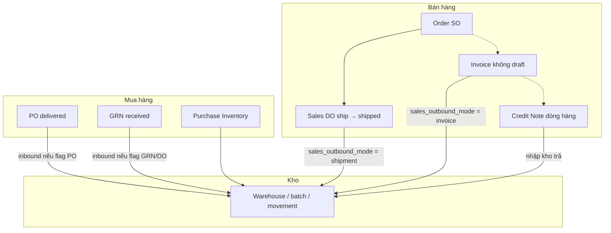

# Quy trình PO · DO · SO · Invoice · Warehouse (Craveva)

**Mục đích:** Một file **hướng dẫn nghiệp vụ + vận hành** theo thứ tự: mua (PO/DO), kho, bán (SO/Invoice), cấu hình.  
**Đối tượng:** PM, BA, vận hành, dev mới.  
**Cập nhật:** 2026-04-12

**Bảng thật trên DB (GRN / Sales DO) vs legacy:** [`ERP_SO_PO_DO_GRN_SCHEMA_AND_LEGACY_MATRIX_VI.md`](ERP_SO_PO_DO_GRN_SCHEMA_AND_LEGACY_MATRIX_VI.md) — trong file này vẫn dùng từ nghiệp vụ “DO nhận hàng”, “phiếu giao bán”; **bảng ghi hiện tại** lần lượt là `grns` và `sales_dos`, không còn `delivery_orders` / `sales_shipments` cho CRUD chính.

**Chi tiết kỹ thuật (class, bảng, observer):** [`SALES_PURCHASE_FLOW.md`](SALES_PURCHASE_FLOW.md)  
**Trả hàng bán (Credit Note → nhập kho):** [`SALES_RETURN_CREDIT_NOTE_STOCK_VI.md`](SALES_RETURN_CREDIT_NOTE_STOCK_VI.md)  
**Chỉ riêng module kho (điều chỉnh, chuyển, ledger):** [`WAREHOUSE_FLOW_VA_NGHIEP_VU_VI.md`](WAREHOUSE_FLOW_VA_NGHIEP_VU_VI.md)  
**URL, quyền, DB:** [`WAREHOUSE_MASTER_GUIDE.md`](WAREHOUSE_MASTER_GUIDE.md)  
**Trạng thái triển khai, audit, prompt Cursor:** [`WAREHOUSE_TOM_TAT_NOI_BO.md`](WAREHOUSE_TOM_TAT_NOI_BO.md) §10–11  
**Test tay / UAT E2E:** [`UAT_CHECKLIST_MUA_BAN_KHO_E2E_VI.md`](UAT_CHECKLIST_MUA_BAN_KHO_E2E_VI.md) · _redirect:_ [`WAREHOUSE_UAT_CHECKLIST_MIAOLIN.md`](WAREHOUSE_UAT_CHECKLIST_MIAOLIN.md)

---

## 1) Chuẩn bị master (làm trước mọi luồng)

| Thứ tự | Việc                                                                                                       | Ghi chú                                                                                             |
| ------ | ---------------------------------------------------------------------------------------------------------- | --------------------------------------------------------------------------------------------------- |
| 1      | **Công ty / tenant** đúng                                                                                  | Mọi chứng từ gắn `company_id`.                                                                      |
| 2      | **Kho** (Warehouse): ít nhất 1 kho active, 1 kho mặc định công ty (nếu dùng)                               | Module Warehouse bật.                                                                               |
| 3      | **Sản phẩm** (Product): SKU, loại **hàng hóa** (không phải service) nếu cần trừ tồn                        | Chi tiết form/import: [`FLOW_ADD_PRODUCT.md`](FLOW_ADD_PRODUCT.md).                                 |
| 4      | **Khách** (Client): có **kho mặc định giao** (`default_warehouse_id`) khi dùng **Scope B** xuất theo khách | Import/map: `WAREHOUSE_MASTER_GUIDE`, `SCHEMATIC_LAYER_USERS_CLIENT_DETAILS_1_1_REASON_AND_FIX.md`. |

---

## 2) Luồng mua hàng → **tăng** tồn (nhập kho)

### 2.1 Purchase Order (PO) — đặt hàng NCC

1. Tạo **PO**: chọn vendor, **`warehouse_id`** (kho nhận), dòng có **`product_id` + số lượng**.
2. Khi hàng được coi là **đã giao** (`delivery_status` → **delivered** theo UI/flow):
    - Nếu `WAREHOUSE_INBOUND_FROM_PO_DELIVERED=true` và module Warehouse bật → hệ thống ghi **nhập kho** qua `StockMovementService` (tham chiếu PO).
3. **PurchaseBill** (hóa đơn NCC): cập nhật trạng thái thanh toán/billed — **không** tự tạo movement kho trong observer bill.

### 2.2 Phiếu nhận hàng mua (GRN / DO inbound — bảng `grns`)

- Trong Craveva, chứng từ nhận hàng mua gắn PO: nghiệp vụ thường gọi **GRN** hoặc “DO nhập”; **bảng ghi hiện tại** là **`grns` / `grn_items`** (không còn là nguồn ghi chính trên `delivery_orders`). Khi trạng thái **received** có thể ghi nhập lô nếu `WAREHOUSE_INBOUND_FROM_DO_RECEIVED=true`.
- **Quan trọng:** Trên cùng môi trường chỉ nên coi **một** nguồn nhập “chuẩn” cho cùng một lần nhận thật: **PO delivered** **hoặc** **DO received** — bật cả hai dễ **nhập đôi** cùng một lô.

### 2.3 Purchase Inventory (phiếu tồn / sync tuyệt đối)

- Điều chỉnh tồn theo **số đích** từng kho + sản phẩm → delta → movement.
- Chi tiết bảng ghi: [`FLOW_ADD_INVENTORY.md`](FLOW_ADD_INVENTORY.md).

### 2.4 Trả hàng mua / Vendor Credit / công nợ NCC

- **PurchaseBill** = hóa đơn/công nợ phải trả gắn PO; **không** ghi `stock_movements` trong observer bill.
- **Vendor Credit** (`PurchaseVendorCredit`) = chứng từ **giảm phải trả** (thường gắn bill → gián tiếp PO). **Xuất kho trả NCC:** dòng `purchase_vendor_items` loại `item` có `product_id` → `VendorCreditWarehouseStockService` / `StockMovementService::recordOutbound`; xóa chứng từ hoặc sửa/xóa dòng → hoàn tác / đồng bộ lại (idempotent theo khóa movement). Chi tiết: [`PURCHASE_RETURN_VENDOR_CREDIT_STOCK_VI.md`](PURCHASE_RETURN_VENDOR_CREDIT_STOCK_VI.md).
- **Vendor Payment** = thanh toán / cấn trừ bill (và có thể áp credit).
- Luồng vận hành nên thống nhất: **ghi Vendor Credit khi đã thống nhất SL trả** và cấu hình inbound/outbound kho để tránh lệch với thực tế vật lý.

---

## 3) Luồng kho thuần (không qua PO)

- **Điều chỉnh tay** (+/−), **chuyển kho** giữa các kho, xem **sổ movement**.
- Xem [`WAREHOUSE_FLOW_VA_NGHIEP_VU_VI.md`](WAREHOUSE_FLOW_VA_NGHIEP_VU_VI.md).

---

## 4) Luồng bán — **Order (SO)** → **Sales DO**/**Invoice** → **xuất kho**

### 4.1 Sales Order (Order)

1. Tạo **Order** + dòng (`OrderItems`), gắn **client**, sản phẩm, SL.
2. **Lưu ý sản phẩm:** Với một SO, hệ thống **mặc định** coi **tối đa một** `Invoice` gắn `order_id` (1 SO → 1 HĐ kiểu “Cách 1”). Chi tiết: `SALES_PURCHASE_FLOW.md` §2.1.
3. **Trừ tồn:** Trạng thái Order **không** tự gọi xuất kho; phụ thuộc mode outbound ở bước sau.

### 4.2 Sales DO (entity: `SalesDo` — bảng `sales_dos`)

1. Tạo một hoặc nhiều **Sales DO** từ cùng một SO (partial shipment). Route/controller có thể vẫn mang tên “shipment”; dữ liệu lưu ở **`sales_dos` / `sales_do_items`** (xem ma trận legacy).
2. Chuyển trạng thái: `draft -> confirmed -> shipped -> delivered` (hoặc `cancelled`).
3. Khi mode outbound là `shipment`, action **Ship** (`SalesDoService::ship`, trạng thái → **`shipped`**) gọi `SalesShipmentStockService::applyOutboundForShipment` — **đây là bước trừ tồn**, không phải `delivered` một mình.
4. Có action **reverse** (`SalesDoService::reverse`) hoặc **cancel** (nếu đã outbound) để hoàn kho / hủy reservation khi xử lý sai lệch vận hành.

### 4.3 Invoice (hóa đơn bán)

1. Tạo **Invoice** từ order hoặc độc lập; dòng kiểu **item** + **`product_id`** mới đủ điều kiện xuất kho hàng.
2. Khi mode outbound là `invoice`, invoice **không** ở trạng thái **draft** và **không** phải credit note sẽ ghi outbound theo kho resolve (khách → công ty → kho active).

### 4.4 Cấu hình orchestration outbound (quan trọng)

Đồng thời thỏa:

- `.env`: **`WAREHOUSE_SALES_OUTBOUND_ENABLED=true`** (và `php artisan config:clear`).
- `.env`: **`WAREHOUSE_SALES_OUTBOUND_MODE=shipment|invoice`** (mặc định code đang là **`shipment`**; override bằng env nếu tenant cần legacy invoice outbound).
- Module **Warehouse** bật; user đăng nhập có **`warehouse`** trong `user_modules`.
- Đã migrate các bảng kho liên quan (`invoice_warehouse_stock_postings` nếu mode invoice).
- **Payment:** Khi flag trên, `PaymentObserver` **không** chỉnh legacy `PurchaseStockAdjustment` cho đường stock warehouse (tránh lệch đa kho).

Quy tắc tránh double deduction:

- Mode `shipment`: chỉ **Sales DO** (`sales_dos` → ship) trừ tồn, invoice không trừ thêm.
- Mode `invoice`: giữ legacy invoice outbound.

**Tắt flag** = không tự tạo outbound từ shipment/invoice (tồn chỉ thay đổi bởi PO/DO/inventory/chuyển kho/điều chỉnh).

### 4.5 Trả hàng bán (Credit Note)

- Khi phát hành dòng **Credit Note** có `product_id` (hàng): **nhập kho** qua `CreditNoteWarehouseStockService` (idempotent; xóa CN hoàn tác). Chi tiết: [`SALES_RETURN_CREDIT_NOTE_STOCK_VI.md`](SALES_RETURN_CREDIT_NOTE_STOCK_VI.md).
- Mode `shipment`: kho nhận trả có thể suy từ **Sales DO** đã ship cùng order + sản phẩm; có thể ghi đè bằng `credit_note_items.warehouse_id` (migration Warehouse).

---

## 5) Sơ đồ tổng (tóm tắt)

---

## 6) Checklist vận hành nhanh sau khi cấu hình

- [ ] Một nguồn inbound: PO **hoặc** DO (không double inbound).
- [ ] `WAREHOUSE_ALLOW_NEGATIVE_STOCK` theo policy.
- [ ] Chọn đúng mode outbound (`shipment` hoặc `invoice`) theo quy trình vận hành.
- [ ] Thử 1 PO delivered → tồn tăng + có dòng movement inbound.
- [ ] Nếu mode `shipment`: thử SO 10 → **Ship** DO 4 + 6 (trừ tồn tại bước ship), không cho vượt tồn khả dụng.
- [ ] Nếu mode `invoice`: thử 1 invoice không draft -> tồn giảm + outbound + posting.
- [ ] Sửa/xóa invoice → reversal đúng kỳ vọng (UAT).

---

_File cũ [`B2B_ERP_PO_DO_INVOICE_GUIDE.md`](B2B_ERP_PO_DO_INVOICE_GUIDE.md) chỉ còn stub trỏ về đây để giữ link cũ._
