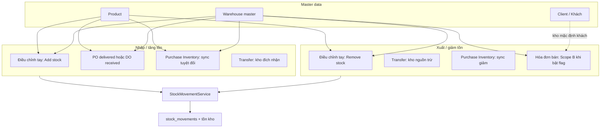

# Warehouse — Luồng nghiệp vụ & giải thích (tiếng Việt)

**Cập nhật:** 2026-03-28  
**Đối tượng:** Người cần hiểu **business logic** (không cần đọc code).  
**Quy trình tổng PO/DO/SO/Invoice/kho (đọc trước):** [`QUY_TRINH_PO_DO_SO_INVOICE_WAREHOUSE_VI.md`](QUY_TRINH_PO_DO_SO_INVOICE_WAREHOUSE_VI.md)  
**Runbook + kế hoạch nâng cấp (WUP):** [`WAREHOUSE_RUNBOOK_AND_UPGRADE_PLAN_VI.md`](../FUNC_IMPROVE/04_WH_RUNBOOK_UPGRADE_VI.md)  
**Checklist UAT E2E (Mua · Bán · Kho):** [`UAT_CHECKLIST_MUA_BAN_KHO_E2E_VI.md`](UAT_CHECKLIST_MUA_BAN_KHO_E2E_VI.md)  
**Kỹ thuật sâu (DB, URL, permission):** [`WAREHOUSE_MASTER_GUIDE.md`](WAREHOUSE_MASTER_GUIDE.md)

---

## 1) Một phút: chuyện gì đang xảy ra trong hệ thống?

- **Sản phẩm (Product)** = danh mục hàng (tên, SKU, giá…). **Không** gắn cố định “thuộc kho nào” trên form Product (trừ khi sau này bổ sung field).
- **Kho (Warehouse)** = **địa điểm** vật lý (hoặc logic) cất hàng trong công ty.
- **Tồn thực tế** được ghi theo cặp **(Kho + Sản phẩm [+ lô/HSD nếu có])**. Mỗi lần nhập/xuất hợp lệ, hệ thống cập nhật **tổng tồn** và ghi **dòng trên sổ movement** (ledger).

**Nguyên tắc vàng:** Mọi thay đổi tồn “chuẩn warehouse” trong Craveva đi qua **`StockMovementService`** → cập nhật batch/tổng tồn + tạo dòng **`stock_movements`**. Không nên “sửa tay” bảng tồn trong DB khi vận hành.

---

## 2) Sơ đồ tổng thể (ai đụng vào tồn?)

---

## 3) Từng luồng — “Khi tôi làm X thì hệ thống làm Y”

### 3.1 Điều chỉnh tồn tay (Stock adjustment)

| Bước nghiệp vụ                                                   | Ý nghĩa                                                                                                                                                        |
| ---------------------------------------------------------------- | -------------------------------------------------------------------------------------------------------------------------------------------------------------- |
| User chọn **kho + sản phẩm + số lượng** (thêm hoặc giảm) + lý do | Ghi nhận kiểm kê, hư hỏng, chỉnh sai số…                                                                                                                       |
| **Thêm (inbound)**                                               | Tồn tại kho **tăng**; có dòng movement **nhập**.                                                                                                               |
| **Giảm (outbound)**                                              | Tồn **giảm**; nếu không đủ tồn và cấu hình **không cho âm** → **báo lỗi**, không đổi số.                                                                       |
| Có lô/HSD hay không?                                             | Service hỗ trợ **FEFO** (ưu tiên hạn dùng trước) **nếu** dữ liệu lô/HSD có trên batch; form UI có thể chưa nhập đủ → FEFO hạn chế (xem mục hạn chế cuối file). |

**UI (gợi ý):** nhóm Operations → Stock adjustment; nút Add / Remove trong màn hình tồn (popup).

---

### 3.2 Chuyển kho (Transfer)

| Bước                                                         | Ý nghĩa                                                                     |
| ------------------------------------------------------------ | --------------------------------------------------------------------------- |
| Chọn **kho nguồn**, **kho đích**, **sản phẩm**, **số lượng** | Hàng chuyển từ A sang B                                                     |
| **Không** cho trùng nguồn = đích                             | Lỗi validation                                                              |
| Giao dịch **atomic**                                         | Hoặc cả hai bên cập nhật đúng, hoặc rollback — không “mất hàng giữa chừng”. |

---

### 3.3 Nhập kho từ mua hàng (Purchase → Warehouse)

Có **hai cơ chế** trong config; **trên mỗi môi trường chỉ nên bật một** làm “chuẩn”, tránh **nhập đôi** cùng một lô hàng:

| Cơ chế           | Khi nào hệ thống nhập kho?                                                                              |
| ---------------- | ------------------------------------------------------------------------------------------------------- |
| **PO delivered** | Khi **Purchase Order** chuyển trạng thái giao hàng phù hợp (delivered) — theo observer/module Purchase. |
| **DO received**  | Khi **Delivery Order** loại inbound chuyển **received**.                                                |

**Cảnh báo:** Nếu bật **đồng thời** hai cờ env cho hai luồng trên và vận hành cùng một lô qua cả hai → tồn có thể **cộng hai lần**.

---

### 3.4 Purchase Inventory — đồng bộ tồn “số đích”

User (hoặc import) đặt **một con số tuyệt đối** cho **kho + sản phẩm**. Hệ thống tính **chênh lệch** so với hiện tại và tạo các movement **nhập/xuất** để **khớp đúng** con số đó.

---

### 3.5 Bán hàng — Hóa đơn (Invoice) trừ tồn kho (**Scope B**, đã có trong code)

Đây là phần trước đây checklist gọi là **gap Critical**; hiện đã có **phiên bản v1** khi bật cấu hình.

| Câu hỏi                         | Trả lời (v1 trong Craveva)                                                                                                                                                                             |
| ------------------------------- | ------------------------------------------------------------------------------------------------------------------------------------------------------------------------------------------------------ |
| **Khi nào trừ tồn?**            | Sau khi **lưu invoice** (observer), với invoice **không phải draft** và **không phải credit note**. **Không** chờ “đã thanh toán” trừ khi PM đổi sau này.                                              |
| **Trừ kho nào?**                | Thứ tự: **kho mặc định của khách** (`client` / `clientdetails.default_warehouse_id` hợp lệ) → **kho mặc định công ty** → **một kho active đầu tiên**. **Chưa** có chọn **kho từng dòng** trên invoice. |
| **Tránh trừ hai lần?**          | Có bảng **`invoice_warehouse_stock_postings`**: mỗi lần sync, hệ thống **hoàn tác posting cũ** rồi **ghi lại** theo trạng thái mới (idempotent theo nghiệp vụ).                                        |
| **Xóa / sửa invoice?**          | **Xóa:** hoàn tác posting trước khi xóa dòng. **Sửa:** sync lại (reverse + post lại).                                                                                                                  |
| **Thanh toán (Payment)?**       | Khi bật outbound warehouse, **không** còn chỉnh **`PurchaseStockAdjustment`** legacy theo `product_id` không kho (tránh lệch với sổ kho).                                                              |
| **Kiểm tra tồn trước khi lưu?** | Với luồng **direct stock** (`do_it_later == direct`) và flag bật: kiểm tra theo **`WarehouseProductStock`** (và phần “đã cam kết” trên invoice unpaid khác).                                           |

**Bật tính năng:** env **`WAREHOUSE_SALES_OUTBOUND_ENABLED=true`**, module Warehouse bật, user có module warehouse, chạy migration bảng posting. Chi tiết file & env: [`WAREHOUSE_TOM_TAT_NOI_BO.md`](WAREHOUSE_TOM_TAT_NOI_BO.md).

---

### 3.6 Sổ movement (Stock movements)

Chỉ để **xem lịch sử**: lọc theo kho, loại phát sinh, tìm sản phẩm. **Reference** có thể là text (deep-link sang PO/Invoice tùy backlog).

---

### 3.7 Quyền & đa công ty

User không đủ quyền thì không vào / không thao tác được; dữ liệu **company A** không lộ sang **company B**.  
_Tên quyền trên UI có thể khác tài liệu PM (vd. `view_warehouses` thay vì `warehouse_view`) — cần đối chiếu bảng permission thật khi UAT._

---

## 4) So sánh nhanh: Craveva vs ERP khác (vd. Dingxin / quy trình “order → invoice”)

Một số doanh nghiệp mô tả quy trình kiểu:

- Đơn hàng tạo ở hệ A → đưa sang ERP → **lưu hóa đơn bán** thì **tồn khả dụng (available)** giảm → **soạn hàng xong, xác nhận hóa đơn** thì coi như **xuất thật**.

**Trong Craveva (Scope B v1):** thời điểm ghi **xuất kho vật lý qua movement** đang gắn với **lưu invoice (không draft)** như mục 3.5 — **không** tách thêm bước “confirm sau picking” trừ khi sau này PM yêu cầu thêm trạng thái/trigger.

**Ý nghĩa tích hợp:** Nếu đồng bộ tồn với ERP khác, cần thống nhất **“số Craveva là available hay on-hand hay đã trừ khi lưu invoice”** để hai bên không hiểu khác nhau.

---

## 5) Các hạn chế / việc chưa làm hết (đừng kỳ vọng sai)

| Chủ đề                                | Ghi chú                                                                                                     |
| ------------------------------------- | ----------------------------------------------------------------------------------------------------------- |
| **Kho từng dòng invoice**             | Chưa có field trên dòng hàng; tách nhiều kho = tách nhiều invoice hoặc đổi kho mặc định khách (workaround). |
| **Return / void sau khi chốt**        | V1: xóa/sửa invoice, credit note không outbound; quy trình return phức tạp có thể cần bổ sung.              |
| **UI nhập batch/HSD** trên mọi form   | Có thể vẫn thiếu → FEFO kém nếu không có dữ liệu lô.                                                        |
| **Deep link** từ ledger sang chứng từ | Backlog UX.                                                                                                 |
| **UAT checklist**                     | Code ≠ đã pass UAT — vẫn phải chạy checklist trên staging.                                                  |

---

## 6) Gợi ý “sóng” UAT (khi làm việc với PM/QA)

1. **Sóng 1:** Kho master + điều chỉnh tay + chuyển kho + movement + nhập mua (một inbound) + inventory sync + quyền.
2. **Sóng 2:** Bật **Scope B**, test **invoice → trừ tồn**, không trùng legacy payment, idempotency, xóa/sửa.
3. **Sóng 3:** Medium/Low (FEFO UI, deep link, …).

---

## 7) FAQ nhanh

| Câu hỏi                             | Trả lời                                                                                                         |
| ----------------------------------- | --------------------------------------------------------------------------------------------------------------- |
| Tạo Product có phải chọn kho không? | **Thường không.** Tồn theo kho phát sinh khi giao dịch.                                                         |
| Client có liên quan không?          | Có thể có **kho mặc định** — dùng cho resolve kho khi bán (Scope B).                                            |
| “Đã chuẩn UAT report chưa?”         | **Chưa** cho đến khi QA chạy checklist và ký; xem [`WAREHOUSE_TOM_TAT_NOI_BO.md`](WAREHOUSE_TOM_TAT_NOI_BO.md). |

---

_Tài liệu này thay thế các bản “giải thích checklist + Dingxin” đã gộp. Chi tiết độ dài checklist xem file checklist riêng._
