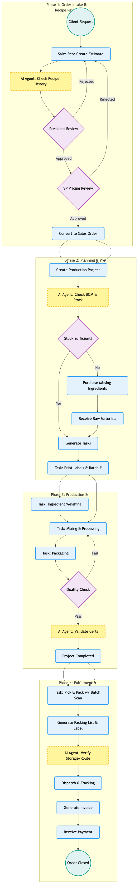

# Biomixing Digital Transformation Proposal: Craveva Unified Cognitive ERP

**Prepared for:** Biomixing (Agri-tech/Biotech)
**Technology Partner:** Craveva
**Date:** 2026-02-13

---

## 1. Executive Summary

Biomixing is at the forefront of sustainable farming solutions, yet its rapid growth in specialized biotech products (like EHPurge) has introduced operational complexities—specifically in **custom recipe management**, **inventory traceability**, and **multi-stage approval workflows**.

To support this rapid scaling, we propose the **Craveva Unified Cognitive ERP**:

1.  **Craveva ERP (hub.craveva.com):** A robust, modular operational backbone tailored for manufacturing and distribution.
2.  **Craveva AI (ai.craveva.com):** A native "AI Brain" that lives within the ecosystem, providing real-time intelligence to Executives, R&D, and Factory Directors.

**The Result:** A seamless architecture where the President can review recipes, the Factory Director can check stock, and the VP can simulate margins—all in one unified platform.

---

## 2. The Solution: Unified Cognitive ERP

We propose a single ecosystem where operations and intelligence are inseparable.

### **2.1 The Operational Backbone (Craveva ERP)**
Craveva ERP handles the core lifecycle:

| Module | Function for Biomixing |
| :--- | :--- |
| **Leads & Estimates** | Manages the "Custom Recipe" request flow from distributors (e.g., Siam Shrimp). |
| **Project Management** | Replaces manual "Project Request Forms". Tracks the Factory Director's tasks (Labeling, Mixing) and Business Assistant's checks. |
| **Inventory & Purchase** | Manages critical biotech raw materials (Probiotics, Feed Additives) with batch tracking. |
| **Finance & Invoicing** | Automates the "Settlement" phase, linking delivery notes directly to invoices. |

### **2.2 The Intelligence Layer (Craveva AI)**
Because the AI lives where the data lives, there is **zero latency**.

| Agent Role | Capability | Biomixing Use Case |
| :--- | :--- | :--- |
| **Sales AI Agent** | **Historical Intelligence** | *President's Review:* Instantly retrieves past successful formulations for a specific client to aid approval decisions. |
| **Analytic AI Agent** | **Predictive Simulation** | *VP's Pricing:* Simulates "What if raw material costs rise by 5%?" to set safe margins. |
| **Analytic AI Agent** | **Operational Query** | *Factory Director:* Checks real-time stock across warehouses using natural language ("Do we have enough Base A?"). |

### 2.3 Omni-Channel Sales Agent (LINE & WhatsApp)

As a multinational organisation, Biomixing’s sales teams and distributors operate across multiple countries and messaging habits. To support this with **low integration risk and fast time-to-value**, Craveva will provide an **omni-channel Sales Agent** that is rolled out in **phases** and built on a **single, reusable webhook pattern** (the same pattern already used by the Recruit AI module).

- **Step 1: Single-Channel Pilot (WhatsApp First)**  
  - Start with **one primary channel (WhatsApp)** in a single pilot market.  
  - Use a standard WhatsApp Business API provider to handle messaging infrastructure, while Craveva focuses only on the webhook and business logic.  
  - The same **Sales AI Agent** that supports the President and VP in the ERP will power these WhatsApp conversations.  
  - Scope is intentionally limited to a few flows: recent orders, basic product recommendations, and quote triggers.

- **Step 2: Reuse the Same Pattern for LINE**  
  - Once the team is comfortable with WhatsApp flows and testing, **LINE** is added using the **same webhook design**: incoming message → Craveva endpoint → AI + ERP lookup → reply.  
  - For markets like Thailand, Japan, and Taiwan, where LINE is dominant, Biomixing’s sales agents will then be able to:  
    - Search client history (“Show last 3 orders for this farm”) directly from LINE.  
    - Trigger quote/estimate creation in the ERP from chat.  
    - Receive AI-suggested responses for technical questions (storage conditions, dosage, compatible products).  
  - All conversations are logged back into Craveva as timeline events against the client record.

- **Single Brain, Simple Flow**  
  - Both channels call into **one unified Sales AI endpoint** that reads from live ERP data (clients, prices, stock, delivery status).  
  - This avoids building two separate bots and keeps the integration lean and maintainable.  
  - Initial UAT is performed with a focused set of internal pilot users and conversation scenarios before expanding.

- **Benefits for Biomixing as an MNC**  
  - **One brain, many channels:** Consistent answers and pricing policy whether the sales agent is on desktop ERP, WhatsApp, or (later) LINE.  
  - **Controlled rollout:** Phased implementation that reduces operational risk and allows learning before wider deployment.  
  - **Country flexibility:** Local teams can keep using their preferred messaging apps without creating data silos.

---

## 3. Addressing Biomixing's Specific Workflow

We have analyzed your current process flow (Order → Recipe Review → Production → Delivery) and designed Craveva to eliminate bottlenecks at each step:

### **Phase 1: Order & Recipe Review (The "3-Day Wait")**
*   **Current Process:** Sales submits a request → President reviews formula history → VP checks pricing. This manual loop often takes 3-4 days.
*   **Craveva Solution:** 
    *   **Sales AI Agent:** As the Sales Rep types the Estimate, the AI instantly displays: *"Last 3 similar recipes for Siam Shrimp were approved with 15% margin."*
    *   **Result:** The President has all data *immediately*, potentially reducing approval time from days to hours.

### **Phase 2: Production Planning (The "Manual Gap")**
*   **Current Process:** Factory Director manually checks stock to decide: *"Do we have enough?"* If yes (3-4 days), if no (5-7 days). This relies on paper "Project Request Forms".
*   **Craveva Solution:** 
    *   **Analytic AI Agent:** Automatically scans the Bill of Materials (BOM) against live inventory.
    *   **Result:** The system flags "Low Stock" *before* the order is even signed, triggering an automatic Purchase Request for the missing biotech ingredients.

### **Phase 3: Production & Fulfillment (Compliance)**
*   **Current Process:** Manual checks for "Labeling", "Mixing", and "Quality Certs" before shipping. Risk of human error or temperature deviations.
*   **Craveva Solution:** 
    *   **Projects Module:** The system *locks* the "Create Delivery Note" button until the "Quality Check" task is complete.
    *   **Logistics AI Agent:** Automatically verifies storage conditions (e.g., "Keep < 25°C") and suggests the best Cold Chain carrier.
    *   **Result:** 100% compliance. No product leaves the factory without a digital quality stamp and safe routing.

---

## 4. Implementation Roadmap (Fast-Track)

Craveva's modular architecture allows for a phased, high-impact rollout.

### **Phase 1: Operations Foundation (Weeks 1-4)**
*   **Goal:** Digitize the "Order to Cash" flow.
*   **Actions:**
    *   Setup Craveva ERP (Sales, Inventory, Projects).
    *   Import Product Master (EHPurge, Probiotics).
    *   Configure the "President Approval" workflow in Estimates.

### **Phase 2: Intelligence Activation (Weeks 5-8)**
*   **Goal:** Turn data into decisions.
*   **Actions:**
    *   Activate **Sales AI Agent**: Train on historical recipe PDFs and client emails.
    *   Activate **Analytic AI Agent**: Connect to Inventory for real-time stock queries.
    *   Launch a **WhatsApp Sales Agent pilot** in one market using the existing webhook pattern, with a small set of supported flows (recent orders, basic recommendations, quote triggers).
    *   **Training:** Show the Factory Director and pilot sales team how to "talk" to the ERP and AI.

---

## 5. Strategic Advantage

By choosing **Craveva (ERP + AI)**, Biomixing gains:

1.  **Unified Ecosystem:** A single platform for both operations (Order/Delivery) and intelligence (Forecasting/Approvals).
2.  **Agility:** Custom workflows (like your Recipe Review) are native configurations.
3.  **Future-Proofing:** As your biotech product lines grow, the AI learns and adapts to new formulations automatically.

**Conclusion:** This proposal aligns perfectly with your goal of "Pioneering Sustainable Farming Solutions" by giving you a sustainable, scalable digital infrastructure.
