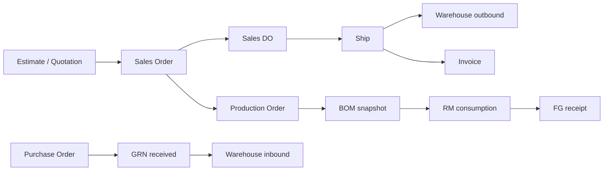

# System Map

## Nền tảng

- Laravel 11.54.0, PHP 8.3.30, Composer 2.9.5.
- Frontend Blade, Bootstrap 4.6, jQuery, Laravel Mix, Axios helper tại `resources/js/http/apiClient.js`.
- MySQL là database chính; queue/cache/session cấu hình có Redis.
- Kiến trúc multi-tenant dựa trên `company_id`, `HasCompany` và `CompanyScope`.

## Quy mô source

| Thành phần | Số lượng audit |
|---|---:|
| Module | 26 |
| Active root migration | 506 |
| Active module migration | 0 |
| Model/entity class | 506 |
| Controller | 404 |
| Service | 37 |
| Job | 56 |
| Test file | 193 |
| Blade view | 2.186 |
| Route | 3.369 |

## Module

Affiliate, Asset, Biolinks, Biometric, CyberSecurity, DeveloperTools, EInvoice, LanguagePack, Letter, LineIntegration, Onboarding, Payroll, Performance, Policy, Pricing, Production, ProjectRoadmap, Purchase, QRCode, Recruit, ServerManager, Sms, Subdomain, Warehouse, Webhooks và Zoom.

## Luồng nghiệp vụ trọng yếu

## Tenancy contract

- `app/Traits/HasCompany.php:11-14` đăng ký global `CompanyScope`.
- `app/Scopes/CompanyScope.php:21-35` chỉ thêm `company_id` khi có authenticated user và `company()`.
- Vì queue/command thường không có authenticated user, job/service phải truyền và lọc `company_id` rõ ràng. Không thể xem global scope là hàng rào tenant trong background process.

## Database contract hiện tại

- `database/migrations`: consolidated baseline 503 bảng + prepare/finalize.
- `database/schema/mysql-schema.dump`: schema legacy riêng, chứa migration history đến 2022.
- `database/seeders/data/full_20260701`: reference seed JSON, 121 bảng/3.458 dòng, không chứa user/auth.
- `fresh-install:create-superadmin`: bước bắt buộc sau seed để tạo tài khoản đầu tiên.
- Browser installer hiện chưa import bộ JSON seed, được chính tài liệu consolidation ghi nhận tại `docs/MIGRATION_CONSOLIDATION_PLAN.md:136-138`.

## Runtime và operations

- Scheduler có nhiều task mỗi phút và tự chạy database/Redis workers tại `app/Console/Kernel.php:203-220`.
- Runbook lại khuyến nghị Supervisor là worker daemon tại `docs/SERVER_RUNBOOK.md`.
- Deployment target được tài liệu hóa là Ubuntu, Nginx, PHP-FPM, queue worker cùng user `www-data`.
